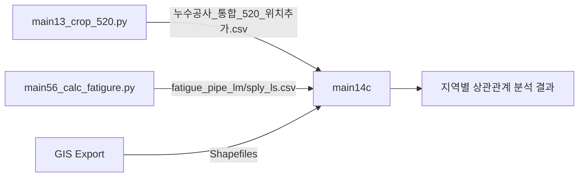

# main14c_subregion_correlations.py 함수 호출 그래프

## 개요
하위 지역별 재작업 위치와 파이프 위험 요인 상관관계 분석 (EPSG:5179 좌표계)

## 입력 파일

### 1. 재작업 데이터 (CSV)
- **통합 파일 (필수)**:
  - `results/main13_crop_520/누수공사_통합_520_위치추가.csv`
  - 생성 스크립트: `main13_crop_520.py`
  - 포함 데이터: 지상누수, 지하누수 통합 데이터

### 2. K-factors 및 피로 손상 데이터 (CSV)
- `results/main56_calc_fatigure/fatigue_pipe_lm.csv`
  - 생성 스크립트: `main56_calc_fatigure.py`
  - 포함 컬럼: 
    - K-factors: `STD_DIP`, `K_age`, `K_soil`, `K_traffic`, `hoop_stress`, `K_stress`, `K_total`
    - K_repair (선택적): 재작업 계수
    - D_final: `0470_D_final`, `0480_D_final`, `0490_D_final` (지역별 보정손상도)

- `results/main56_calc_fatigure/fatigue_sply_ls.csv`
  - 생성 스크립트: `main56_calc_fatigure.py`
  - 포함 컬럼: PIPE_LM과 동일한 구조

### 3. 공간 데이터 (Shapefile)
- **파이프 형상 데이터**:
  - `data/raw/export_shp_(0520)/V_WTL_PIPE_LM.shp`
  - `data/raw/export_shp_(0520)/V_WTL_SPLY_LS.shp`
  - 용도: 파이프 위치 및 LineString geometry 정보

- **구역 경계 데이터**:
  - `data/raw/export_shp_(0520)/WEA_SMLZ_AS.shp`
  - 용도: 하위 지역(0470, 0480, 0490) 경계 추출
  - 지역 라벨: `SML05200470`, `SML05200480`, `SML05200490`

## 함수 호출 그래프 (파일 입력 포함)

```
[스크립트 진입점]
│
└── main()
    ├── parse_arguments()
    ├── analyze_subregion_correlation() [지역별 분석]
    │   ├── load_repair_data_for_subregion()
    │   │   ├── load_repair_csv_files() [src.main14_common.data_loader]
    │   │   │   ├── 📄 results/main13_crop_520/누수공사_통합_520_위치추가.csv
    │   │   │   └── convert_to_epsg5179() [src.common.spatial_utils]
    │   │   └── get_subregion_boundary()
    │   │       └── 📄 data/raw/export_shp_(0520)/WEA_SMLZ_AS.shp
    │   │
    │   ├── load_pipe_factors_for_subregion()
    │   │   ├── load_fatigue_csv() [src.main14_common.data_loader]
    │   │   │   ├── 📄 results/main56_calc_fatigure/fatigue_pipe_lm.csv
    │   │   │   └── 📄 results/main56_calc_fatigure/fatigue_sply_ls.csv
    │   │   ├── ShapefileLoader.load_pipe_shapefile() [src.common.shapefile_loader]
    │   │   │   ├── 📄 data/raw/export_shp_(0520)/V_WTL_PIPE_LM.shp
    │   │   │   └── 📄 data/raw/export_shp_(0520)/V_WTL_SPLY_LS.shp
    │   │   └── get_subregion_boundary()
    │   │       └── 📄 data/raw/export_shp_(0520)/WEA_SMLZ_AS.shp
    │   │
    │   ├── create_repair_clusters() [src.main14_common.clustering]
    │   ├── match_clusters_to_pipes() [src.main14_common.clustering]
    │   └── analyze_correlation() [src.main14_common.correlation_analysis]
    │
    ├── create_comparison_report()
    ├── save_subregion_results()
    ├── create_subregion_visualizations()
    └── analyze_all_subregions()
```

## 출력 파일

### 지역별 출력 (각 0470, 0480, 0490)
- `results/main14c/{region}/repair_k_factors_matched.csv` - 매칭된 클러스터-파이프 데이터
- `results/main14c/{region}/correlation_analysis.txt` - 상관관계 분석 보고서
- `results/main14c/{region}/metadata.json` - 지역별 메타데이터
- `results/main14c/{region}/scatter_plot.png` - 산점도 시각화
- `results/main14c/{region}/boxplot.png` - 박스플롯 시각화

### 통합 비교 출력
- `results/main14c/comparison/subregion_comparison.csv` - 지역 간 비교 데이터
- `results/main14c/comparison/correlation_matrix.csv` - 상관계수 매트릭스
- `results/main14c/comparison/correlation_heatmap.png` - 히트맵 시각화
- `results/main14c/comparison/factor_importance.png` - 요인 중요도 그래프
- `results/main14c/comparison/integrated_report.md` - 통합 분석 보고서

## 데이터 의존성


