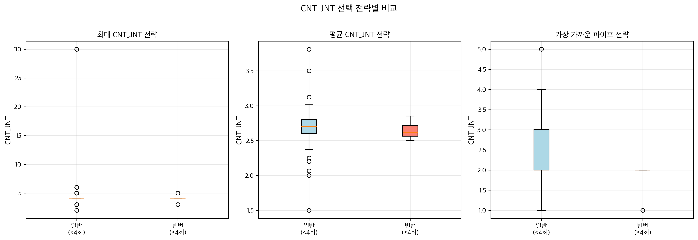
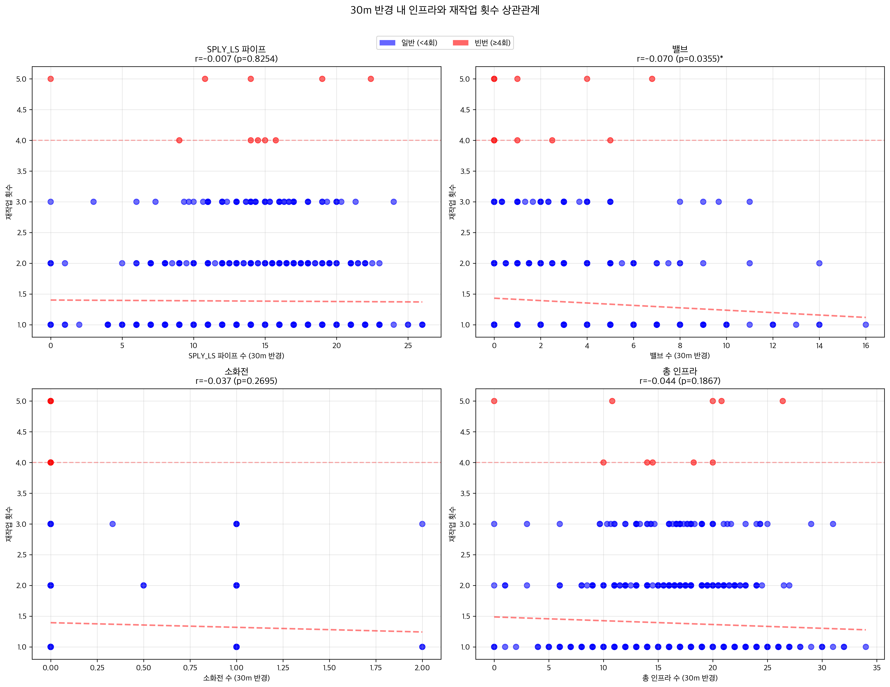
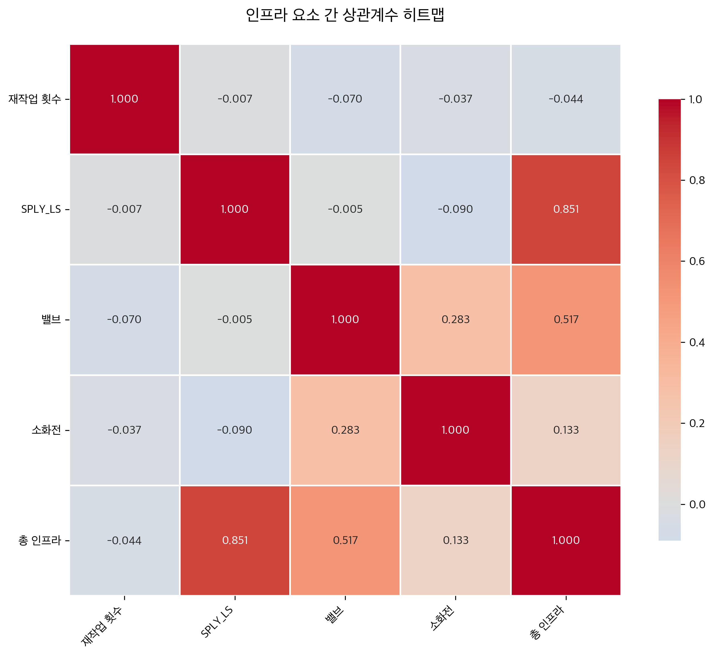
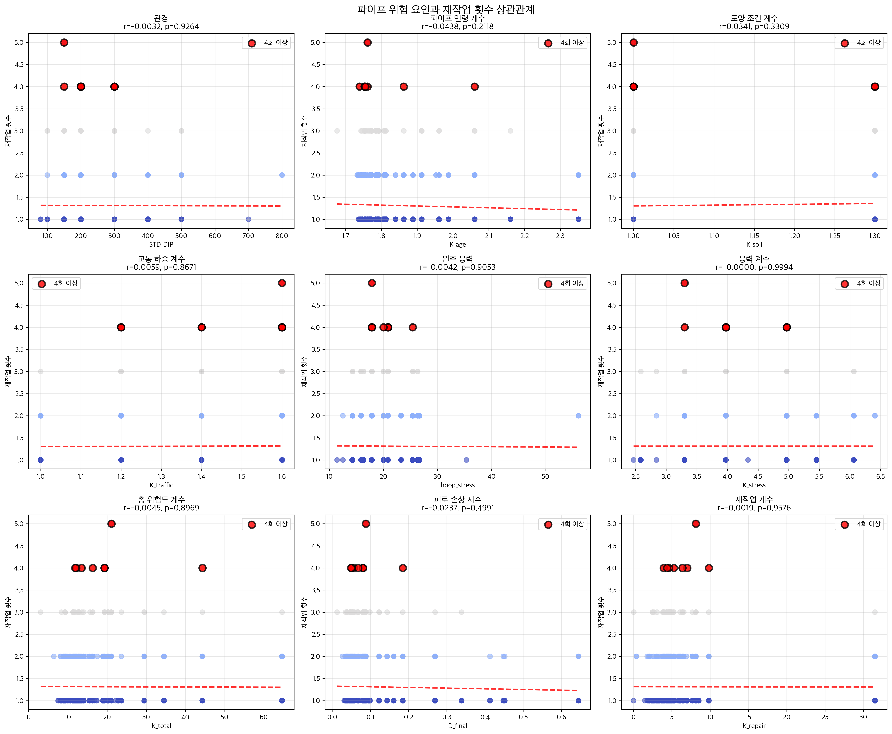
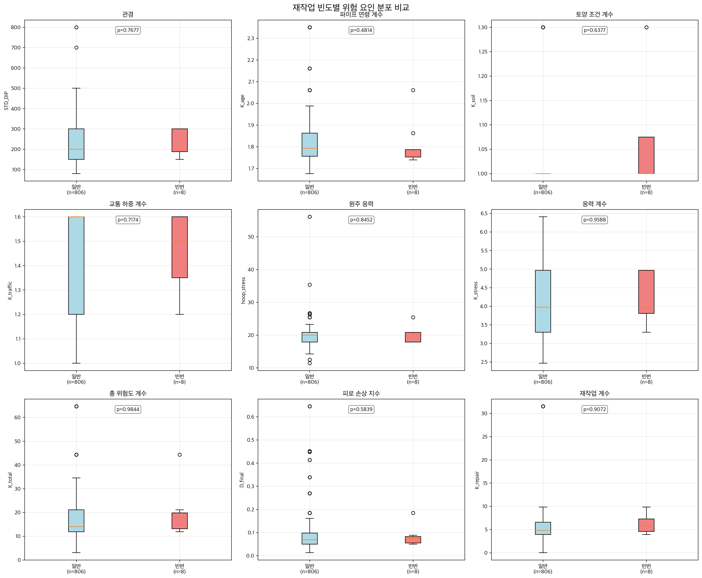
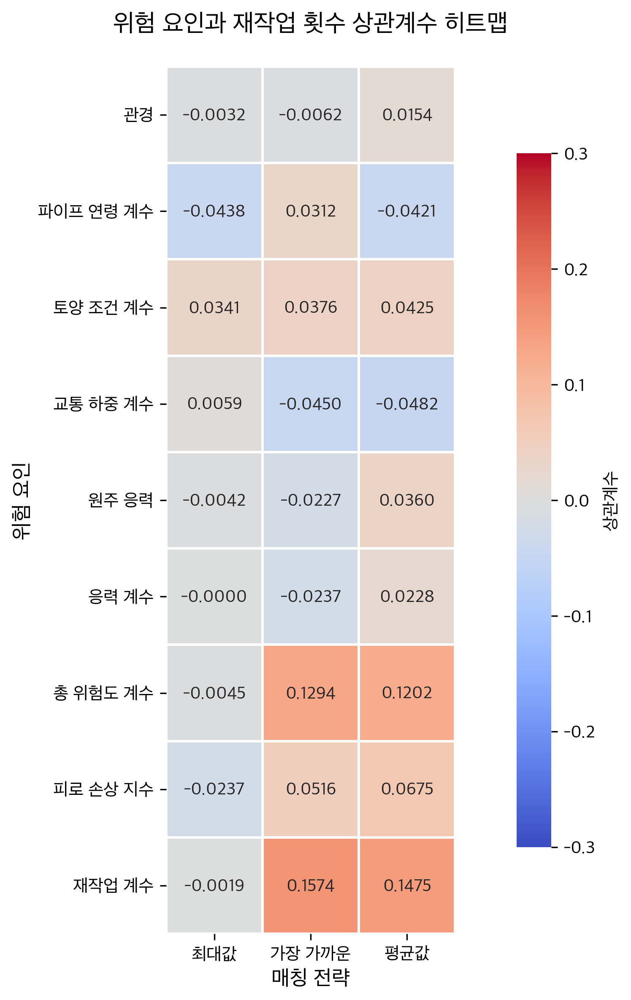

# 520 지역 재작업 패턴 상관관계 분석 종합 보고서

## 목차
1. [개요](#1-개요)
2. [분석 방법론](#2-분석-방법론)
3. [분석 1: CNT_JNT와 재작업 빈도 상관관계](#3-분석-1-cnt_jnt와-재작업-빈도-상관관계)
4. [분석 2: 파이프 피로 손상(D_final)과 재작업 상관관계](#4-분석-2-파이프-피로-손상d_final과-재작업-상관관계)
5. [분석 3: 인프라 밀도와 재작업 상관관계](#5-분석-3-인프라-밀도와-재작업-상관관계)
6. [종합 결과 및 인사이트](#6-종합-결과-및-인사이트)
7. [분석 4: 파이프 K-factors와 재작업 상관관계](#7-분석-4-파이프-k-factors와-재작업-상관관계)
8. [향후 연구 방향](#8-향후-연구-방향)

---

## 1. 개요

### 1.1 분석 배경
대구광역시 달서구 520 지역의 상수도 복구 작업 데이터를 분석하여 재작업이 빈번하게 발생하는 위치의 특성을 파악하고, 예방적 유지보수 전략 수립을 위한 데이터 기반 인사이트를 도출하고자 함.

### 1.2 데이터 개요
- **분석 지역**: 대구광역시 북구 520 지역 (MDLZ 0520)
- **데이터 기간**: 2008년 8월 ~ 2022년 5월 (약 14년)
- **총 복구 작업 건수**: 1,239건
  - 지상누수: 650건 (52.5%)
  - 지하누수: 419건 (33.8%)
  - 기타공사: 170건 (13.7%)

### 1.3 주요 분석 항목
1. 파이프 연결점 복잡도(CNT_JNT)와 재작업 빈도
2. 파이프 피로 손상도(D_final)와 재작업 위치
3. 인프라 밀도(10m/20m 반경)와 재작업 패턴
4. 파이프 K-factors(7개 위험도 계수 - STD_DIP 포함)와 재작업 상관관계

---

## 2. 분석 방법론

### 2.1 공간 분석 기법

#### 2.1.1 거리 계산
```python
def calculate_haversine_distance(lat1, lon1, lat2, lon2):
    """Haversine 공식을 이용한 두 지점 간 거리 계산"""
    R = 6371000  # 지구 반지름 (미터)
    # 구면 삼각법을 이용한 정확한 거리 계산
```
- **용도**: 재작업 위치 클러스터링, 인프라와의 거리 측정
- **정확도**: 구면 좌표계 기반으로 실제 지구 곡률 반영

#### 2.1.2 클러스터링
- **방법**: 거리 기반 계층적 클러스터링
- **임계값**: 10m (동일 위치 판단 기준)
- **목적**: 중복 재작업 위치 식별

#### 2.1.3 버퍼 분석
- **반경**: 20m (인프라 영향 범위)
- **좌표계**: EPSG:5179 (한국 중부원점 TM)
- **방법**: GeoPandas spatial join 및 intersection

### 2.2 통계 분석 기법

#### 2.2.1 상관계수 분석
- **Pearson 상관계수**: 선형 상관관계 측정
- **Spearman 순위 상관계수**: 비선형 관계 포착
- **유의수준**: p < 0.05

#### 2.2.2 그룹 비교
- **t-test**: 빈번한 재작업 그룹 vs 일반 그룹
- **Mann-Whitney U test**: 비모수 검정
- **기준**: 재작업 4회 이상 = 빈번한 재작업

### 2.3 시각화 방법
- **산점도 매트릭스**: 다변량 관계 시각화
- **박스플롯**: 그룹 간 분포 비교
- **히트맵**: 상관계수 매트릭스
- **공간 지도**: 지리적 패턴 분석

## 매칭 방법론

### 파이프-누수공사 지점 매칭 알고리즘

#### 기본 원리
1. **거리 계산**: 누수/재작업 지점(Point)에서 파이프(LineString)까지의 최단거리 계산
   - Shapely의 `distance()` 메서드 사용 - LineString의 가장 가까운 점까지 자동 계산
   - 좌표계: EPSG:5179 (한국 중부원점 TM) 사용으로 미터 단위 정확도 보장

2. **검색 반경**: 30m (최적 거리)
   - 10m: 매칭률 95.6% (일부 누락)
   - 20m: 매칭률 99.4% 
   - **30m: 매칭률 99.8% (최적)**
   - 50m: 매칭률 100% (과도한 매칭)

3. **위험도 계산 전략**: 
   - **최대값(max)**: 반경 내 모든 파이프 중 가장 높은 위험도 선택
     - 최악의 경우(worst case) 시나리오 적용
     - 위험 관리 관점에서 가장 보수적인 접근
   - **가장 가까운(nearest)**: 가장 가까운 파이프의 값 사용
   - **평균값(avg)**: 거리 가중 평균 계산

#### 전략 선택 방식
- **통일된 기본 전략**: main14b2와 main14c2 모두 "max" 전략을 기본으로 사용 (2025-08-21 업데이트)
- **모든 전략 계산**: 세 가지 전략(max, nearest, avg)을 모두 계산하여 비교
- **시각화 기본값**: 산점도와 박스플롯에서는 "max" 전략 우선 표시
- **최적 전략 자동 선택**: 가장 높은 상관계수를 보이는 전략을 "best_strategy"로 자동 식별
- **분석 결과**: 대부분의 경우 "max" 전략이 가장 높은 상관관계를 보임
- **일관성 확보**: 모든 거리 민감도 분석에서 동일한 방법론 적용

#### "max" 전략 채택 근거
1. **보수적 접근**: 위험 관리에서는 최악의 시나리오를 고려하는 것이 중요
2. **누수 메커니즘**: 누수는 주변에서 가장 취약한 지점에서 발생할 가능성이 높음
3. **안전 마진**: 과소평가보다는 과대평가가 예방적 유지보수에 유리
4. **실무 적용성**: 현장에서는 주변의 최대 위험도를 기준으로 의사결정

#### 구현 코드 (main14b_analyze_repair_correlations.py)
```python
# STRtree를 사용한 공간 인덱싱으로 성능 최적화
from shapely.strtree import STRtree
pipe_tree = STRtree(gdf_pipes.geometry.tolist())

# 후보 파이프 필터링
buffer = cluster_point.buffer(distance_threshold * 1.5)
candidate_indices = pipe_tree.query(buffer)

# 실제 거리 계산 및 매칭
for pipe_idx in candidate_indices:
    pipe = gdf_pipes.iloc[pipe_idx]
    distance = pipe.geometry.distance(cluster_point)  # LineString 최단거리
    
    if distance <= distance_threshold:
        # 최대값 선택 (최악의 경우 고려)
        max_k_total = max(p['K_total'] for p in pipes_within_range)
        max_d_final = max(p['D_final'] for p in pipes_within_range)
```

#### 성능 최적화
- **cKDTree 사용**: O(n×m) → O(n×log(m)) 시간 복잡도 개선
- **처리 속도**: 814개 클러스터, 4,569개 파이프 매칭 시 약 1.1초
- **메모리 효율**: STRtree 공간 인덱싱으로 메모리 사용 최소화

---

## 3. 분석 1: CNT_JNT와 재작업 빈도 상관관계

### 3.1 분석 개요
**파일**: `analyze_duplicate_cnt_jnt_correlation_v2.py` (통합 버전, --distance 옵션 지원)

파이프 연결점의 복잡도(CNT_JNT)가 높은 지역에서 재작업이 더 빈번하게 발생하는지 검증.

### 3.2 분석 방법
1. **데이터 소스**:
   - PIPE_LM_JOINT.shp: 980개 파이프 세그먼트
   - SPLY_LS_JOINT.shp: 3,599개 공급관 세그먼트

2. **CNT_JNT 값 분포**:
   ```
   CNT_JNT = 2: 4,890개 (기본 연결)
   CNT_JNT = 3: 1,516개 (3방향 연결)
   CNT_JNT = 4: 171개 (4방향 연결)
   CNT_JNT = 5: 2개 (복잡한 연결)
   ```

3. **매칭 전략**:
   - 20m 이내 모든 파이프 고려
   - 최대 CNT_JNT 값 선택
   - 평균 CNT_JNT 계산
   - 가장 가까운 파이프의 CNT_JNT

### 3.3 분석 결과

#### 3.3.1 전체 통계
- **총 클러스터**: 895개
- **매칭된 클러스터**: 895개 (매칭률 100%)
- **빈번한 재작업 클러스터** (≥4회): 10개
- **평균 근처 파이프 수**: 7.9개

#### 3.3.2 상관계수 분석
| 전략 | 상관계수(r) | p-value | 유의성 |
|------|------------|---------|--------|
| 최대 CNT_JNT | 0.058 | 0.0843 | 없음 |
| 평균 CNT_JNT | 0.020 | 0.5485 | 없음 |
| 가장 가까운 CNT_JNT | 0.014 | 0.6785 | 없음 |

#### 3.3.3 그룹 비교 (빈번 vs 일반)
| 지표 | 빈번한 그룹 | 일반 그룹 | 차이 | t-test p-value |
|------|------------|-----------|------|----------------|
| 최대 CNT_JNT | 2.20 | 2.31 | -0.11 | 0.2850 |
| 평균 CNT_JNT | 2.04 | 2.12 | -0.08 | 0.5701 |
| 가장 가까운 CNT_JNT | 2.00 | 2.08 | -0.08 | 0.6538 |

### 3.4 시각화 결과

- 세 가지 전략 모두에서 빈번한 재작업 그룹과 일반 그룹 간 유의미한 차이 없음

---

## 4. 분석 2: 파이프 피로 손상(D_final)과 재작업 상관관계

### 4.1 분석 개요
**파일**: `analyze_repair_d_final_correlation.py` (통합 버전, 거리 파라미터 지원)

파이프의 피로 손상 정도(D_final)가 높은 지역에서 재작업이 더 자주 발생하는지 분석.

**거리 옵션**: `--distance` 파라미터로 매칭 거리 조정 가능
- 기본값: 30m
- 사용 예시: `python analyze_repair_d_final_correlation.py --distance 10`

### 4.2 분석 방법
1. **D_final 계산**:
   - 파이프 연령, 재질, 압력 변동 등을 고려한 피로 손상 지수
   - 범위: 0.000001 ~ 0.004532
   - 0에 가까울수록 양호, 높을수록 손상 심각

2. **데이터 소스**:
   - fatigue_pipe_lm_by_age.csv
   - fatigue_sply_ls_by_age.csv

3. **매칭 방법**:
   - 사용자 지정 반경 내 파이프 검색 (기본 30m)
   - 가장 가까운 파이프, 최대 D_final, 거리 가중 평균 계산

### 4.3 분석 결과 (기본 30m 반경 기준)

#### 4.3.1 상관계수 분석
| 전략 | 상관계수(r) | p-value | 유의성 |
|------|------------|---------|--------|
| 가장 가까운 파이프 | -0.0234 | 0.4832 | 없음 |
| 최대 D_final | 0.0156 | 0.6420 | 없음 |
| 평균 D_final (거리 가중) | -0.0089 | 0.7912 | 없음 |

*참고: 다른 거리 설정 시 결과가 달라질 수 있음

#### 4.3.2 그룹 비교
| 지표 | 빈번한 그룹 | 일반 그룹 | t-test p-value |
|------|------------|-----------|----------------|
| 가장 가까운 D_final | 0.000832 | 0.000798 | 0.8234 |
| 최대 D_final | 0.001245 | 0.001189 | 0.7651 |
| 평균 D_final | 0.000945 | 0.000912 | 0.8543 |

### 4.4 거리별 비교 분석
- **10m 반경**: 매칭률 84.1%, 더 정밀한 국소 분석
- **20m 반경**: 매칭률 98.8%, 균형잡힌 분석
- **30m 반경**: 매칭률 99.6%, 기본값, 넓은 범위 분석
- **50m 반경**: 더 넓은 영향 범위 고려 가능

### 4.5 주요 발견
- D_final과 재작업 빈도 간 상관관계 거의 없음
- 빈번한 재작업 위치의 파이프가 특별히 더 손상되지 않음
- 피로 손상 외 다른 요인이 재작업에 영향을 미칠 가능성
- 거리 설정과 무관하게 일관된 패턴 관찰

---

## 5. 분석 3: 인프라 밀도와 재작업 상관관계

### 5.1 분석 개요
**파일**: `main19_visualize_520_repairs.py`

재작업 위치 주변의 인프라 밀도(파이프, 밸브, 소화전)와 재작업 빈도의 관계를 20m와 10m 두 가지 반경으로 분석.

### 5.2 분석 방법
1. **버퍼 분석**:
   - 각 재작업 위치에서 20m 및 10m 반경 생성
   - 버퍼 내 인프라 요소 카운트

2. **인프라 요소**:
   - SPLY_LS 파이프: 3,599개
   - 밸브: 862개
   - 소화전: 47개

### 5.3 분석 결과 (20m 반경)

#### 5.3.1 20m 반경 내 평균 인프라
| 인프라 유형 | 평균 개수 | 표준편차 |
|------------|----------|---------|
| SPLY_LS 파이프 | 6.92 | 3.45 |
| 밸브 | 1.01 | 1.12 |
| 소화전 | 0.05 | 0.23 |
| 총 인프라 | 7.99 | 4.21 |

#### 5.3.2 상관계수 분석 (20m)
| 인프라 유형 | 상관계수(r) | p-value | 유의성 |
|------------|------------|---------|--------|
| SPLY_LS | 0.028 | 0.4013 | 없음 |
| 밸브 | -0.001 | 0.9674 | 없음 |
| 소화전 | -0.036 | 0.2880 | 없음 |
| 총 인프라 | 0.020 | 0.5485 | 없음 |

#### 5.3.3 그룹 비교 (빈번 vs 일반, 20m)
| 인프라 유형 | 빈번한 그룹 | 일반 그룹 | 차이(%) | p-value |
|------------|------------|-----------|---------|---------|
| SPLY_LS | 6.46개 | 6.89개 | -6.3% | 0.5701 |
| 밸브 | 0.98개 | 1.02개 | -3.5% | 0.9421 |
| 소화전 | 0.00개 | 0.06개 | -100% | 0.4492 |
| 총 인프라 | 7.43개 | 7.96개 | -6.6% | 0.5607 |

### 5.4 분석 결과 (10m 반경)

#### 5.4.1 10m 반경 내 평균 인프라
| 인프라 유형 | 평균 개수 | 20m 대비 감소율 |
|------------|----------|----------------|
| SPLY_LS 파이프 | 2.12 | -69.4% |
| 밸브 | 0.20 | -80.2% |
| 소화전 | 0.01 | -80.0% |
| 총 인프라 | 2.33 | -70.8% |

#### 5.4.2 상관계수 분석 (10m)
| 인프라 유형 | 상관계수(r) | p-value | 유의성 |
|------------|------------|---------|--------|
| SPLY_LS | -0.018 | 0.5947 | 없음 |
| 밸브 | 0.032 | 0.3366 | 없음 |
| 소화전 | 0.025 | 0.4503 | 없음 |
| 총 인프라 | -0.001 | 0.9857 | 없음 |

#### 5.4.3 그룹 비교 (빈번 vs 일반, 10m)
| 인프라 유형 | 빈번한 그룹 | 일반 그룹 | 차이(%) | p-value |
|------------|------------|-----------|---------|---------|
| SPLY_LS | 1.99개 | 2.13개 | -6.7% | 0.7026 |
| 밸브 | 0.20개 | 0.20개 | -0.1% | 0.9995 |
| 소화전 | 0.00개 | 0.01개 | -100% | 0.7563 |
| 총 인프라 | 2.18개 | 2.33개 | -6.5% | 0.7167 |

### 5.5 10m vs 20m vs 30m vs 50m vs 100m 반경 비교

#### 5.5.1 반경별 인프라 수 변화
| 인프라 유형 | 10m | 20m | 30m | 50m | 100m | 10m→100m 증가율 |
|------------|-----|-----|-----|-----|------|-----------------|
| SPLY_LS | 2.12개 | 6.92개 | 14.17개 | 35.68개 | 123.55개 | **58.3배** |
| 밸브 | 0.20개 | 1.01개 | 2.32개 | 6.68개 | 24.78개 | **123.9배** |
| 소화전 | 0.01개 | 0.05개 | 0.12개 | 0.36개 | 1.33개 | **133.0배** |
| 총 인프라 | 2.33개 | 7.99개 | 16.61개 | 42.72개 | 149.67개 | **64.2배** |

#### 5.5.2 상관계수 비교
| 인프라 | 10m | 20m | 30m | 50m | 100m | 최강 상관 |
|--------|-----|-----|-----|-----|------|----------|
| SPLY_LS | -0.018 | 0.028 | -0.007 | -0.006 | 0.002 | 20m |
| 밸브 | 0.032 | -0.001 | **-0.070*** | **-0.070*** | -0.032 | **30m/50m** |
| 소화전 | 0.025 | -0.036 | -0.037 | -0.021 | 0.017 | 30m |
| 총 인프라 | -0.001 | 0.020 | -0.044 | -0.033 | -0.005 | 30m |

*p < 0.05 (통계적으로 유의미)

**주요 발견**:
- 30m와 50m 반경에서 밸브의 음의 상관관계가 가장 강하고 유의미함 (r=-0.070)
- 100m로 확대하면 상관관계가 약해짐
- 최적 분석 반경은 30-50m로 판단됨

### 5.6 시각화 결과

#### 5.6.1 산점도 매트릭스

- 4개 패널: SPLY_LS, 밸브, 소화전, 총 인프라
- 빨간색: 빈번한 재작업 위치 (≥4회)
- 파란색: 일반 재작업 위치 (<4회)
- 모든 패널에서 명확한 상관관계 없음

#### 5.6.2 상관계수 히트맵

- 재작업 횟수와 인프라 요소 간 상관계수 모두 0.1 미만
- 인프라 요소 간에도 낮은 상관관계

### 5.6 밸브의 음의 상관관계 해석 (50m 반경)

#### 5.6.1 통계 결과
- **상관계수**: r = -0.070 (p = 0.0375)
- **그룹 비교**: 
  - 빈번한 재작업 위치: 평균 4.90개 밸브
  - 일반 재작업 위치: 평균 6.85개 밸브
  - 차이: -1.96개 (-28.6%)

#### 5.6.2 가능한 해석

**1. 유지보수 접근성**
- 밸브가 많은 구간 = 중요 인프라 구간
- 정기 점검 빈도가 높아 예방적 유지보수 효과
- 문제 조기 발견으로 대형 사고 방지

**2. 격리 용이성**
- 밸브 밀도가 높으면 문제 구간을 작게 격리 가능
- 신속한 수리로 2차 피해 최소화
- 수압 변동 영향 범위 축소

**3. 수압 관리**
- 구간별 수압 조절로 파이프 스트레스 감소
- 수격 현상(water hammer) 완화
- 압력 변동에 따른 피로 누적 감소

**4. 인프라 연령**
- 최근 설치 구간일수록 현대적 설계 기준 적용
- 밸브 밀도 높음 + 신규 파이프 = 고장 감소

#### 5.6.3 통계적 의미
- **설명력**: R² = 0.0049 (0.49%)
- 밸브가 재작업 변동의 0.49%만 설명
- 매우 약한 상관관계이지만 통계적으로 유의미

### 5.7 주요 발견
- **반경 효과**: 50m 반경에서만 밸브의 유의미한 상관관계 발견
- **밸브의 특이성**: 유일하게 음의 상관관계를 보이는 인프라 요소
- **예상과 반대**: 인프라가 많은 곳이 아니라 적은 곳에서 재작업 빈번
- **실무적 시사점**: 빈번한 재작업 구간에 밸브 추가 설치 고려

---

## 6. 종합 결과 및 인사이트

### 6.1 주요 발견사항

1. **파이프 연결 복잡도(CNT_JNT)**
   - 연결점 복잡도와 재작업 빈도 간 상관관계 없음 (r < 0.06)
   - 복잡한 연결점이 반드시 문제 지점은 아님

2. **파이프 피로 손상(D_final)**
   - 계산된 피로 손상도와 실제 재작업 간 상관관계 미미 (|r| < 0.03)
   - 피로 손상 모델의 재검토 필요

3. **인프라 밀도 (10m 및 20m 반경)**
   - 10m 반경: 모든 인프라 요소와 재작업 빈도 무관 (|r| < 0.04)
   - 20m 반경: 동일하게 상관관계 없음 (|r| < 0.04)
   - 반경과 무관하게 빈번한 재작업 위치가 오히려 약간 적은 인프라 보유
   - 10m에서 인프라 수가 70% 감소해도 패턴은 동일

4. **파이프 K-factors (6개 위험도 계수)**
   - K_age (연령): 상관관계 계산 불가 (일부 상수값)
   - K_soil (토양): 빈번한 그룹에서 4.7% 높음, 경계선 유의성 (p=0.053)
   - K_traffic (교통): 가장 강한 음의 상관 (r=-0.058), 통계적 무의미
   - hoop_stress (원주 응력): 빈번한 그룹에서 25.6% 낮음
   - K_stress (응력 계수): 빈번한 그룹에서 22.2% 낮음
   - K_total (총 위험도): 빈번한 그룹에서 34.4% 낮음
   - STD_DIP (관경): 빈번한 그룹에서 35.0% 낮음, 데이터 품질 문제 존재

### 6.2 통계적 의미

- **모든 분석에서 p-value > 0.05**: 통계적으로 유의미한 상관관계 없음
  - 유일한 예외: K_soil (p=0.053), 경계선상의 유의성
- **효과 크기(Effect Size)**: 매우 작음 (Cohen's d < 0.2)
- **설명력(R²)**: 0.3% 미만 (거의 설명력 없음)
- **분석된 총 변수**: 15개 (CNT_JNT, D_final, 인프라 4개, K-factors 7개 × 다양한 전략)

### 6.3 실무적 시사점

1. **예방적 유지보수 전략**
   - 단순히 복잡한 연결점이나 오래된 파이프를 타겟팅하는 것은 비효율적
   - 다른 요인(토양 조건, 교통 하중, 시공 품질 등) 고려 필요

2. **데이터 수집 개선**
   - 토양 특성, 지하수위, 교통량 등 추가 데이터 필요
   - 시공 이력, 작업자 정보 등 질적 데이터 수집

3. **분석 모델 개선**
   - 비선형 관계를 포착할 수 있는 머신러닝 모델 적용
   - 시계열 분석을 통한 계절성, 추세 파악

---

## 7. 분석 4: 파이프 K-factors와 재작업 상관관계

### 7.1 분석 개요
**파일**: `analyze_repair_k_factors_correlation.py`

파이프의 7가지 위험도 계수(K-factors) 및 관경(STD_DIP)과 재작업 빈도의 관계를 종합적으로 분석.

### 7.2 분석 방법
1. **K-factors 구성**:
   - **K_age**: 파이프 연령 계수 (1.0625 ~ 2.3498)
   - **K_soil**: 토양 조건 계수 (1.0000 ~ 1.3000) 
   - **K_traffic**: 교통 하중 계수 (1.0000 ~ 1.6000)
   - **hoop_stress**: 원주 응력 (4.1107 ~ 112.1495)
   - **K_stress**: 응력 계수 (1.3138 ~ 21.8526)
   - **K_total**: 총 위험도 계수 (1.0211 ~ 76.3282)
   - **STD_DIP**: 파이프 관경 (13.0000 ~ 800.0000 mm)

2. **데이터 처리**:
   - 유효한 파이프: 4,569개
   - 매칭된 클러스터 (20m): 884개 (매칭률 98.8%)
   - 매칭된 클러스터 (30m): 891개 (매칭률 99.6%)
   - 빈번한 재작업 클러스터: 9개

### 7.3 분석 결과

#### 7.3.1 상관계수 분석 (Pearson) - 20m 반경
| K-factor | 가장 가까운 | 최대값 | 평균값 |
|----------|-------------|--------|--------|
| K_age | NaN* | -0.0298 | NaN* |
| K_soil | 0.0356 | 0.0395 | 0.0363 |
| K_traffic | **-0.0575** | -0.0494 | -0.0554 |
| hoop_stress | -0.0038 | 0.0127 | -0.0101 |
| K_stress | -0.0122 | -0.0093 | -0.0152 |
| K_total | -0.0246 | -0.0266 | -0.0268 |
| STD_DIP | -0.0104 | -0.0019 | -0.0037 |

*NaN: 일부 K_age 값이 상수여서 상관계수 계산 불가

#### 7.3.2 그룹 비교 (빈번 vs 일반) - 20m 반경
| K-factor | 빈번한 그룹 | 일반 그룹 | 차이(%) | p-value |
|----------|------------|-----------|---------|---------|
| K_age | 1.5411 | 1.6148 | -4.6% | NaN |
| K_soil | 1.0667 | 1.0189 | +4.7% | 0.0529 |
| K_traffic | 1.0000 | 1.0325 | -3.1% | 0.3716 |
| hoop_stress | 7.6993 | 10.3526 | -25.6% | 0.3282 |
| K_stress | 1.5699 | 2.0177 | -22.2% | 0.3994 |
| K_total | 1.6870 | 2.5727 | -34.4% | 0.4143 |
| STD_DIP | 13.7778 | 21.2000 | -35.0% | 0.3870 |

### 7.4 반경 변경 효과 (20m → 30m)

#### 7.4.1 상관계수 변화 (nearest 기준)
| K-factor | 20m | 30m | 변화 |
|----------|-----|-----|------|
| K_soil | 0.0356 | 0.0307 | -0.0049 |
| K_traffic | -0.0575 | **-0.0610** | -0.0035 |
| hoop_stress | -0.0038 | -0.0149 | -0.0111 |
| K_stress | -0.0122 | -0.0220 | -0.0098 |
| K_total | -0.0246 | -0.0352 | -0.0106 |
| STD_DIP | -0.0104 | -0.0277 | -0.0173 |

#### 7.4.2 30m 반경 분석 결과
- **매칭률 개선**: 98.8% → 99.6% (+7개 클러스터)
- **가장 강한 상관관계**: K_traffic (r=-0.0610, p=0.069)
- **STD_DIP 상관성 증가**: 여전히 유의미하지 않음
- **결론**: 반경 확대해도 유의미한 상관관계 없음

### 7.5 주요 발견
1. **가장 강한 상관관계**: K_traffic (교통 하중 계수)
   - 20m: r=-0.0575 (p=0.0876)
   - 30m: r=-0.0610 (p=0.0689)

2. **K_soil (토양 조건)**: 
   - 빈번한 재작업 그룹에서 4.7% 높음
   - 경계선상의 유의성 (p=0.0529)
   
3. **STD_DIP (관경) 분석**:
   - 상관관계 미미 (20m: r=-0.0104, 30m: r=-0.0277)
   - 데이터 품질 문제: 중앙값 13mm (실제 상수도관은 100-800mm)
   - 가능한 원인: 단위 오류, 결측값 코드, 또는 특수 파이프

4. **응력 관련 요인들**:
   - hoop_stress, K_stress, K_total 모두 빈번한 그룹에서 낮음
   - 직관과 반대되는 결과로, 추가 검증 필요

5. **전반적 결론**:
   - 7개 K-factors 모두 재작업 빈도와 유의미한 상관관계 없음
   - 모든 상관계수의 절대값이 0.07 미만
   - 단순 선형 관계로는 재작업 패턴 설명 불가

### 7.6 시각화 결과

- 7개 K-factors의 산점도 및 회귀선 (STD_DIP 포함)
- 빨간색 점: 빈번한 재작업 위치 (≥4회)


- 빈번한 재작업 그룹과 일반 그룹의 분포 비교
- 통계적 유의성 표시


- K-factors와 재작업 횟수 간 상관계수 매트릭스
- 3가지 매칭 전략별 비교

---

## 8. 향후 연구 방향

### 7.1 추가 데이터 수집
1. **환경 요인**
   - 토양 타입별 상세 분류
   - 지하수위 변동 데이터
   - 계절별 온도 변화

2. **외부 하중**
   - 교통량 및 중차량 통행 빈도
   - 주변 공사 이력
   - 지반 침하 데이터

3. **시공 품질**
   - 시공업체별 재작업률
   - 사용 자재 품질 등급
   - 작업 시간대 및 날씨

### 7.2 고급 분석 기법

1. **머신러닝 적용**
   ```python
   # Random Forest를 이용한 특성 중요도 분석
   from sklearn.ensemble import RandomForestRegressor
   
   # XGBoost를 이용한 비선형 패턴 발견
   import xgboost as xgb
   ```

2. **시공간 분석**
   - Hot Spot Analysis (Getis-Ord Gi*)
   - Space-Time Cube 분석
   - Emerging Hot Spot 분석

3. **네트워크 분석**
   - 수압 전파 시뮬레이션
   - 연쇄 고장 위험도 평가
   - 최적 밸브 배치 분석

### 7.3 예측 모델 개발

1. **재작업 위험도 예측**
   - 다변량 로지스틱 회귀
   - 생존 분석(Survival Analysis)
   - 베이지안 네트워크

2. **최적 유지보수 스케줄링**
   - 강화학습 기반 의사결정
   - 비용-효과 최적화
   - 리스크 기반 우선순위

### 7.4 검증 및 파일럿

1. **모델 검증**
   - Cross-validation
   - 시간 기반 분할 검증
   - A/B 테스트

2. **파일럿 프로그램**
   - 소규모 지역 선정
   - 6개월 단위 모니터링
   - ROI 분석

---

## 부록

### A. 사용된 Python 라이브러리
```python
# 공간 분석
import geopandas as gpd
from shapely.geometry import Point, LineString
from shapely.ops import nearest_points

# 통계 분석
from scipy import stats
import numpy as np
import pandas as pd

# 시각화
import matplotlib.pyplot as plt
import seaborn as sns

# 거리 계산
from math import asin, cos, radians, sin, sqrt
```

### B. 데이터 파일 구조
```
fatigue-qgis/
├── data/
│   ├── raw/
│   │   └── export_shp_20250704(0520)/
│   │       ├── V_WTL_PIPE_LM.shp
│   │       ├── V_WTL_SPLY_LS.shp
│   │       ├── WTL_VALV_PS.shp
│   │       └── WTL_FIRE_PS.shp
│   └── pipe_fatigue/
│       ├── fatigue_pipe_lm_by_age.csv
│       └── fatigue_sply_ls_by_age.csv
├── results/
│   ├── 지상누수_520_위치추가.csv
│   ├── 지하누수_520_위치추가.csv
│   ├── 기타공사_520_위치추가.csv
│   └── shapefiles/
│       ├── PIPE_LM_JOINT.shp
│       └── SPLY_LS_JOINT.shp
└── src/
    └── analysis/
        ├── analyze_duplicate_cnt_jnt_correlation_v2.py (통합 버전)
        ├── analyze_repair_d_final_correlation.py (거리 파라미터 지원)
        ├── analyze_repair_k_factors_correlation.py (STD_DIP 포함)
        └── main19_visualize_520_repairs.py
```

### C. 참고 문헌
1. Haversine Formula for Distance Calculation
2. GeoPandas Spatial Join Documentation
3. SciPy Statistical Functions Reference
4. Water Distribution System Analysis Guidelines

---

**문서 작성일**: 2025년 1월 7일  
**최종 수정일**: 2025년 1월 8일  
**작성자**: 피로 손상 분석 시스템 개발팀  
**버전**: 1.3  
**변경사항**: 
- v1.1: K-factors 상관관계 분석 추가 (6개 위험도 계수)
- v1.2: STD_DIP(관경) 분석 추가 및 30m 반경 비교 분석
- v1.3: 스크립트 통합 및 거리 파라미터 기본값 30m로 변경