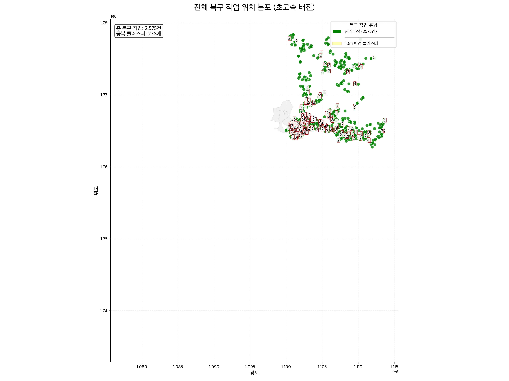

# main12: 위치 시각화 및 중복 분석

**파일명**: `main12_draw_repair2.py`

## 📋 개요
지오코딩된 복구 작업 위치를 지도에 표시하고 중복 위치를 분석합니다.

### 주요 기능
- **통합 CSV 파일 사용** (#26) - main13 방식으로 1개의 통합 파일에서 데이터 읽기
- **복구 작업 유형별 필터링** (#22) - `--repair-type` 옵션으로 특정 유형만 표시 가능
- **이미지 크기 배율 조정** (#17) - 기본 크기를 16×12 inch (4,800×3,600 픽셀)로 변경
- `--scale` 옵션으로 동적 크기 조정 가능
- 데이터 기반 자동 경계 계산 (고정 경계 옵션 제거)
- KDTree 기반 중복 클러스터링 (초고속 성능)
- 긴급공사, 관리대장 데이터 표시 기능 추가 (4가지 복구 유형 모두 시각화)
- 출력 디렉토리 구조 개선 (`results/main12_draw_repair2/`)

## 🚀 사용법

```bash
python src/main12_draw_repair2.py       # 기본 크기 (16×12), 모든 유형 표시
python src/main12_draw_repair2.py --scale 2  # 2배 크기 (32×24)
python src/main12_draw_repair2.py --scale 8  # 이전 크기 (128×96)
python src/main12_draw_repair2.py --show # 화면 표시
python src/main12_draw_repair2.py --min-duplicates 4  # 4회 이상 중복만
python src/main12_draw_repair2.py --repair-type ground  # 지상누수만 표시
python src/main12_draw_repair2.py --repair-type ground,underground  # 지상/지하누수만 표시
python src/main12_draw_repair2.py --output-dir results/custom  # 출력 디렉토리 지정
python src/main12_draw_repair2.py --no-interactive  # 비대화형 모드 (서버 환경용)
```

## 📥 입력 파일
- `results/main11e_merge_all_repairs/누수공사_통합_위치추가.csv`: 통합된 복구 작업 위치 데이터
  - 지상누수, 지하누수, 긴급공사, 관리대장 데이터를 모두 포함
  - `파일타입` 컬럼으로 각 작업 유형을 구분

### 필수 컬럼
- `위도`: 복구 작업 위치의 위도 좌표
- `경도`: 복구 작업 위치의 경도 좌표
- `파일타입`: 복구 작업 유형 (지상누수, 지하누수, 긴급공사, 관리대장)

## 🎛️ 옵션
- `--scale`: 이미지 크기 배율 (기본값: 1)
  - 1: 16×12 inch (DPI 300 기준) - 권장
  - 2: 32×24 inch
  - 8: 128×96 inch - 이전 크기
- `--min-duplicates`: 표시할 최소 중복 횟수 (0: 모두, 2: 중복만, 4: 4회 이상)
- `--skip-duplicates`: 중복 분석 건너뛰기
- `--output-dir`: 출력 디렉토리 경로 (기본값: results/main12_draw_repair2)
- `--no-interactive`: 비대화형 모드로 실행 (matplotlib backend를 Agg로 설정)
- `--show`: 생성된 그래프를 화면에 표시
- `--repair-type`: **표시할** 복구 작업 유형 (기본값: all)
  - `ground`: 지상누수만 표시
  - `underground`: 지하누수만 표시
  - `emergency`: 긴급공사만 표시
  - `registry`: 관리대장만 표시
  - `all`: 모든 유형 표시 (기본값)
  - 여러 개 조합 가능: `ground,underground`
- `--bounds-type`: 지도 **표시 영역(extent)** 설정 (기본값: --repair-type과 동일)
  - `ground`: 지상누수 데이터 영역
  - `underground`: 지하누수 데이터 영역
  - `emergency`: 긴급공사 데이터 영역
  - `registry`: 관리대장 데이터 영역
  - `all`: 전체 데이터 영역
  - 여러 개 조합 가능: `ground,underground`
  - **미지정 시 --repair-type과 동일하게 자동 설정**

### 📌 --repair-type과 --bounds-type의 차이점
- `--repair-type`: 실제로 지도에 **표시될 점**들을 결정
- `--bounds-type`: 지도의 **표시 범위(확대/축소 영역)**를 결정
- 기본 동작: `--bounds-type`을 지정하지 않으면 `--repair-type`과 동일하게 설정
- 두 옵션을 독립적으로 지정하여 유연한 비교 분석 가능

#### 사용 예시
```bash
# 지상누수만 표시 (자동으로 지상누수 영역에 맞춰 확대)
python src/main12_draw_repair2.py --repair-type ground

# 지상누수만 표시, 전체 영역으로 지도 표시
python src/main12_draw_repair2.py --repair-type ground --bounds-type all

# 지상누수만 표시, 지하누수 영역으로 지도 표시 (비교 분석용)
python src/main12_draw_repair2.py --repair-type ground --bounds-type underground

# 관리대장만 표시 (자동으로 관리대장 영역에 맞춰 확대)
python src/main12_draw_repair2.py --repair-type registry
```

## 📤 출력 파일
- `results/main12_draw_repair2/all_repair2_ultra_fast.png`: 전체 통합 이미지
- `results/main12_draw_repair2/all_repair2_ultra_fast_min{n}.png`: n회 이상 중복만 표시 (min-duplicates 옵션 사용시)

## 문제점
- 송이사님에게 받은 `공사관리대장(0520).xlsx`문서를 출력해보면 520 영역에는 데이터가 존재하지 않는다

- 파일명 오류?

## 📚 관련 문서
- [함수 호출 그래프](../call_graph/main12_draw_repair2_call_graph.md)
- [matplotlib 뷰포트 위치 문제 해결](../troubleshooting/matplotlib_viewport_positioning.md) - `--bounds-type` 옵션 사용 시 발생했던 그래프 위치 문제와 해결 방법
- [시각화 출력 규칙](../visualization_rules.md) - 복구 작업 시각화 표준 스타일 가이드
- [클러스터링 알고리즘](../clustering_algorithm.md) - Union-Find 기반 중복 위치 클러스터링 원리

## 🔗 연관 스크립트
- 이전: [`main11*.py`](main11*.md)
- 다음: [`main12a*.py`](main12a*.md)
