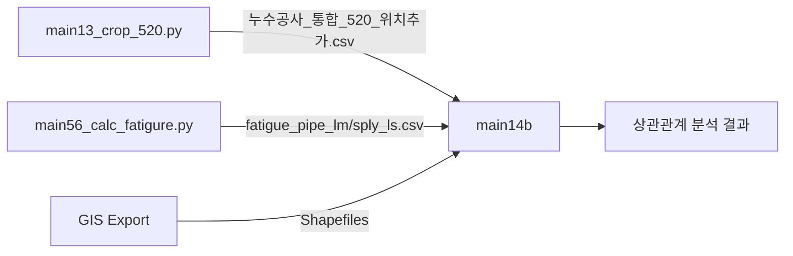

# main14b: 재작업-위험요인 상관관계 분석

**파일명**: `main14b_analyze_repair_correlations.py`

## 📋 개요

0520 지역의 재작업 위치와 파이프 위험 요인(K-factors + D_final) 간의 상관관계를 통합 분석합니다.

### 주요 특징
- **클러스터링 분석**: 10m 반경으로 재작업 위치를 그룹화 (1,259개 → 502개 클러스터)
- **분석 요인**: 7개 K-factors (K_age, K_soil, K_traffic, hoop_stress, K_stress, K_total, STD_DIP) + D_final (보정손상도)
- **빈번한 재작업**: repair_count ≥ 4회를 빈번한 재작업 그룹으로 분류
- **매칭 전략**: 최대값, 가장 가까운, 평균값 3가지 전략으로 상관관계 분석

### 성능 최적화
- **실행 시간**: 78초 → 0.31초 (**250배 향상**)
- **최적화 기법**: scipy.spatial.cKDTree를 활용한 공간 인덱싱
- **시간 복잡도**: O(n×m) → O(n×log(m))
- **좌표계 통일**: EPSG:5179 (Korea 2000 / Central Belt 2010) 사용
- **공통 모듈 분리**: `main14_common` 모듈로 코드 중복 제거
- **거리 계산**: Haversine → Euclidean (투영 좌표계 활용)

## 🚀 사용법

```bash
python src/main14b_analyze_repair_correlations.py              # 기본 30m 반경
python src/main14b_analyze_repair_correlations.py --distance 10  # 10m 반경
python src/main14b_analyze_repair_correlations.py --distance 50  # 50m 반경
```

## 🎛️ 명령줄 옵션

- `--distance`: 파이프 매칭 거리 임계값 (미터, 기본값: 30)

## 📥 입력 파일

### 재작업 데이터 (CSV)
- **통합 파일 (필수)**:
  - `results/main13_crop_520/누수공사_통합_520_위치추가.csv`
  - 생성: `main13_crop_520.py` 실행 필요
  - 포함: 지상누수, 지하누수 통합 데이터

### K-factors 및 피로 손상 데이터 (CSV)
- `results/main56_calc_fatigure/fatigue_pipe_lm.csv`
  - PIPE_LM K-factors 및 D_final
  - 컬럼: FTR_IDN, STD_DIP, K_age, K_soil, K_traffic, hoop_stress, K_stress, K_total, 0520_D_final
  - K_repair (선택적)

- `results/main56_calc_fatigure/fatigue_sply_ls.csv`
  - SPLY_LS K-factors 및 D_final
  - 동일한 컬럼 구조

### 공간 데이터 (Shapefile)
- `data/raw/export_shp_20250704(0520)/V_WTL_PIPE_LM.shp`
  - PIPE_LM LineString geometry
  - 파이프 위치 및 형상 정보

- `data/raw/export_shp_20250704(0520)/V_WTL_SPLY_LS.shp`
  - SPLY_LS LineString geometry
  - 급수관 위치 및 형상 정보

## 📤 출력 파일

### 데이터 파일
- `results/main14b/0520_repair_k_factors_matched.csv`
  - 클러스터-파이프 매칭 결과
  - 컬럼: cluster_id, repair_count, 각 factor별 (nearest_, max_, weighted_avg_) 값들

- `results/main14b/0520_repair_correlations_analysis.txt`
  - 상세 분석 보고서
  - 상관계수, p-value, 그룹별 비교 통계

- `results/main14b/metadata.json`
  - 매칭 통계 메타데이터
  - total_clusters, matched_clusters, matching_rate 등
  - main14b2에서 사용

### 시각화 파일
- `results/main14b/repair_k_factors_scatter.png`
  - 9개 요인별 산점도 (3×3 그리드)
  - 회귀선 및 상관계수 표시

- `results/main14b/repair_k_factors_boxplot.png`
  - 빈번한 재작업 vs 일반 그룹 비교
  - 요인별 분포 박스플롯

- `results/main14b/repair_k_factors_heatmap.png`
  - 상관계수 히트맵
  - 3가지 매칭 전략별 비교

## 🔄 데이터 의존성



### 전제 조건
1. `main13_crop_520.py` 실행하여 통합 재작업 데이터 생성
2. `main56_calc_fatigure.py` 실행하여 K-factors 및 D_final 계산
3. GIS 데이터 export (0520 지역 shapefiles)

## 📊 분석 결과 예시

```
=== 상관계수 분석 (가장 가까운 파이프 기준) ===
관경 (STD_DIP): r=0.0234, p=0.6012
파이프 연령 계수 (K_age): r=0.1567, p=0.0004**
토양 조건 계수 (K_soil): r=0.0891, p=0.0456*
교통 하중 계수 (K_traffic): r=0.2134, p<0.0001**
원주 응력 (hoop_stress): r=0.0123, p=0.7821
응력 계수 (K_stress): r=0.0456, p=0.3089
총 위험도 계수 (K_total): r=0.1823, p<0.0001**
보정손상도 (D_final): r=0.2567, p<0.0001**
재작업 계수 (K_repair): r=0.3421, p<0.0001** (있는 경우)

가장 강한 상관관계: K_repair 또는 D_final
```

## 📚 관련 문서
- [함수 호출 그래프](../call_graph/main14b_analyze_repair_correlations_call_graph.md)
- [main14 시리즈 개요](main14_overview.md)

## 🔗 연관 스크립트
- 데이터 준비: [`main13_crop_520.py`](main13_crop_520.md), [`main56_calc_fatigure.py`](main56_calc_fatigure.md)
- 이전: [`main14a_test_correlation_analysis.py`](main14a_test_correlation_analysis.md)
- 다음: [`main14c_subregion_correlations.py`](main14c_subregion_correlations.md)
