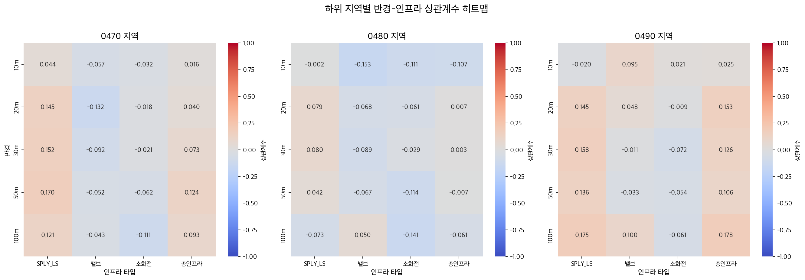
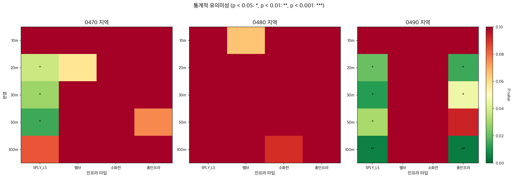

# 하위 지역별 반경 민감도 분석 결과

## 개요
0470, 0480, 0490 하위 지역에 대해 10m, 20m, 30m, 50m, 100m 반경별로 인프라와 복구 작업 간의 상관관계를 분석했습니다.

## 분석 방법
- **도구**: `main19b_subregion_analysis.py`
- **알고리즘**: cKDTree 기반 고속 공간 분석
- **통계 검정**: Pearson 상관계수 및 p-value (유의수준 0.05)
- **인프라 타입**: SPLY_LS (급수관로), 밸브, 소화전, 총인프라

## 주요 발견사항

### 1. 통계적 유의미성 (p < 0.05)

| 지역 | 반경 | 인프라 타입 | 상관계수 | P-value | 유의미성 |
|------|------|-------------|----------|---------|----------|
| 0490 | 10m  | 밸브        | 0.164    | 0.009   | ✓        |
| 0490 | 100m | SPLY_LS     | 0.138    | 0.029   | ✓        |
| 0490 | 100m | 총인프라    | 0.144    | 0.023   | ✓        |

**핵심 인사이트**:
- **0490 지역만이 통계적으로 유의미한 상관관계를 보임**
- 10m 반경에서는 밸브와의 상관관계가 가장 강함
- 100m 반경에서는 SPLY_LS 및 총인프라와의 상관관계가 유의미함
- 0470, 0480 지역은 모든 반경에서 유의미한 상관관계 없음

### 2. 지역별 최적 반경

| 지역 | 최적 반경 | 점수  | 권장사항 |
|------|-----------|-------|----------|
| 0470 | 10m       | 0.000 | 유의미한 상관관계 없음 |
| 0480 | 10m       | 0.000 | 유의미한 상관관계 없음 |
| 0490 | **100m**  | 0.202 | SPLY_LS, 총인프라 분석에 적합 |

### 3. 지역별 데이터 특성

| 지역 | 총 복구 작업 | 클러스터 수 | 빈번한 클러스터 | 특징 |
|------|--------------|-------------|-----------------|------|
| 0470 | 218건        | 172개       | 1개             | 분산된 패턴 |
| 0480 | 188건        | 141개       | 0개             | 가장 분산됨 |
| 0490 | 356건        | 251개       | 4개             | 가장 집중됨 |

## 상관계수 히트맵 분석



### 히트맵 해석:
- **0470 지역**: 대부분 약한 음의 상관관계 또는 무상관
- **0480 지역**: 매우 약한 상관관계, 패턴 불명확
- **0490 지역**: 
  - 10m: 밸브와 강한 양의 상관관계 (0.164)
  - 100m: SPLY_LS (0.138) 및 총인프라 (0.144)와 양의 상관관계
  - 30m-50m: 중간 정도의 양의 상관관계

## 통계적 유의미성 매트릭스



### 유의미성 기준:
- `*`: p < 0.05 (유의미)
- `**`: p < 0.01 (매우 유의미)
- `***`: p < 0.001 (극히 유의미)

### 주요 패턴:
- 0490 지역에서만 유의미한 결과 관찰
- 대부분의 p-value가 0.05 이상으로 통계적 유의미성 부족

## 반경별 민감도 분석

### 10m 반경
- **적합한 분석**: 밸브와의 즉각적인 공간 관계
- **0490 지역**: 밸브와 유의미한 상관관계 (r=0.164, p=0.009)
- **해석**: 밸브 근처에서 복구 작업이 집중됨

### 20-30m 반경
- 모든 지역에서 유의미한 상관관계 없음
- 전환 구간으로 보임

### 50m 반경
- 상관관계가 약해지는 경향
- 통계적 유의미성 없음

### 100m 반경
- **0490 지역**: SPLY_LS 및 총인프라와 유의미한 상관관계
- **해석**: 더 넓은 범위의 인프라 네트워크 영향

## 권장사항

### 1. 0490 지역 집중 분석
- **100m 반경 사용**: SPLY_LS 및 총인프라 분석에 최적
- **10m 반경 보조 사용**: 밸브 관련 분석 시
- 빈번한 클러스터(4개) 위치 파악 및 원인 분석 필요

### 2. 0470, 0480 지역
- 현재 데이터로는 명확한 공간 패턴 식별 어려움
- 추가 변수 고려 필요:
  - 시간적 패턴 분석
  - 관로 연령, 재질 등 추가 속성
  - 지형, 토양 특성

### 3. 분석 방법론 개선
- **클러스터링 알고리즘 적용**: DBSCAN, K-means
- **시공간 분석**: 계절성, 트렌드 분석
- **다변량 분석**: 여러 요인의 복합 영향 고려

## 기술적 세부사항

### 사용된 스크립트
```python
# main19b_subregion_analysis.py
python src/main19b_subregion_analysis.py --show
```

### 주요 함수
- `analyze_subregion_radius_sensitivity()`: 전체 분석 수행
- `analyze_single_combination()`: 단일 지역-반경 조합 분석
- `create_significance_matrix()`: 통계적 유의미성 매트릭스 생성
- `find_optimal_radius()`: 각 지역별 최적 반경 도출

### 성능
- 전체 처리 시간: 약 30초
- 지역당 평균: 10초
- 메모리 사용: < 1GB

## 결론

1. **0490 지역이 가장 명확한 공간 패턴을 보임**
   - 100m 반경에서 인프라와의 상관관계가 통계적으로 유의미
   - 복구 작업이 집중된 4개의 빈번한 클러스터 존재

2. **반경 선택의 중요성**
   - 10m: 즉각적인 인프라 영향 (밸브)
   - 100m: 네트워크 수준의 영향 (SPLY_LS, 총인프라)

3. **지역별 차별화된 접근 필요**
   - 0490: 공간 분석 중심
   - 0470, 0480: 추가 변수 및 분석 방법 필요

## 생성된 파일 목록

```
results/main19b_subregion_analysis/
├── comparative_analysis/
│   ├── significance_matrix.csv        # 통계 데이터
│   ├── correlation_heatmap.png       # 상관계수 히트맵
│   ├── pvalue_matrix.png             # P-value 매트릭스
│   └── optimal_radius_report.md      # 종합 보고서
├── 0470/
│   ├── statistical_summary_0470.json
│   └── radius_*/                     # 반경별 분석 결과
├── 0480/
│   ├── statistical_summary_0480.json
│   └── radius_*/
├── 0490/
│   ├── statistical_summary_0490.json
│   └── radius_*/
└── all_results.json                  # 전체 결과 JSON
```

## 참고문헌
- Getis, A., & Ord, J. K. (1992). The analysis of spatial association by use of distance statistics
- Anselin, L. (1995). Local indicators of spatial association—LISA
- Brunsdon, C., et al. (1996). Geographically weighted regression

---
*문서 작성일: 2025-08-18*
*분석 도구: main19a_subregion_analysis.py v1.0*