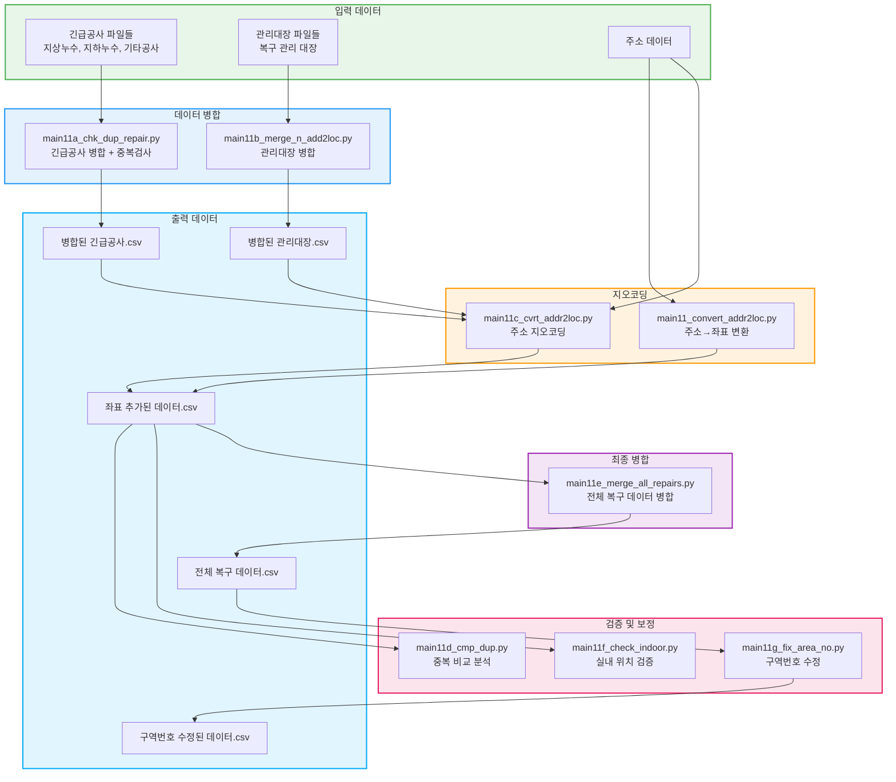

# 지오코딩 파이프라인 (main11 시리즈)

복구 작업 데이터의 주소를 좌표로 변환하고 병합하는 워크플로우입니다.

## 워크플로우 다이어그램



## 실행 순서

### 1단계: 데이터 병합

```bash
# 긴급공사 파일 병합 (중복 검사 포함)
python src/main11a_chk_dup_repair.py

# 관리대장 파일 병합
python src/main11b_merge_n_add2loc.py
```

### 2단계: 지오코딩

```bash
# 주소를 좌표로 변환
python src/main11_convert_addr2loc.py

# 또는 별도 지오코딩
python src/main11c_cvrt_addr2loc.py
```

### 3단계: 검증

```bash
# 중복 비교 분석
python src/main11d_cmp_dup.py

# 실내 위치 검증
python src/main11f_check_indoor.py
```

### 4단계: 최종 병합

```bash
# 전체 복구 데이터 병합
python src/main11e_merge_all_repairs.py
```

### 5단계: 구역번호 수정

```bash
# 좌표 기반 중구역/소구역 번호 수정
python src/main11g_fix_area_no.py
```

## 입출력 파일 요약

| 스크립트 | 입력 | 출력 |
|---------|------|------|
| main11a | 긴급공사 파일들 | 병합된 긴급공사.csv |
| main11b | 관리대장 파일들 | 병합된 관리대장.csv |
| main11/11c | 주소 데이터 | 좌표 추가된 데이터 |
| main11d | 좌표 데이터 | 중복 분석 결과 |
| main11e | 개별 복구 데이터 | 전체 병합 복구 데이터 |
| main11f | 좌표 데이터 | 실내 검증 결과 |
| main11g | 복구 데이터 | 구역번호 수정된 데이터 |

## 관련 문서

- [지오코딩 사용법](../geocoding_usage.md)
- [지오코딩 최적화](../geocoding_optimization.md)
