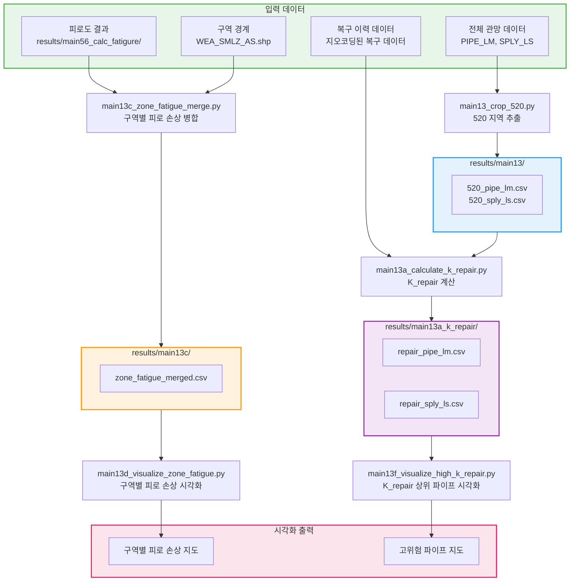

# 520 지역 분석 파이프라인 (main13 시리즈)

520 지역 데이터 추출 및 K_repair 계산, 구역별 피로 손상 분석 워크플로우입니다.

## 워크플로우 다이어그램



## 실행 순서

### 1단계: 520 지역 데이터 추출

```bash
python src/main13_crop_520.py
```

### 2단계: K_repair 계산

```bash
python src/main13a_calculate_k_repair.py
```

### 3단계: 구역별 피로 손상 병합

```bash
# 먼저 main56 실행 필요
python src/main56_calc_fatigure.py

# 구역별 병합
python src/main13c_zone_fatigue_merge.py
```

### 4단계: 시각화

```bash
# 구역별 피로 손상 시각화
python src/main13d_visualize_zone_fatigue.py

# K_repair 상위 파이프 시각화
python src/main13f_visualize_high_k_repair.py
```

## 입출력 파일 요약

| 스크립트 | 입력 | 출력 |
|---------|------|------|
| main13 | 전체 관망 데이터 | results/main13/520_*.csv |
| main13a | 복구 이력 + 520 데이터 | results/main13a_k_repair/repair_*.csv |
| main13c | 피로도 결과 + 구역 경계 | results/main13c/zone_fatigue_merged.csv |
| main13d | 병합된 피로 손상 | 시각화 이미지 |
| main13f | K_repair 결과 | 시각화 이미지 |

## 관련 문서

- [main13a_calculate_k_repair.md](../scripts/main13a_calculate_k_repair.md)
- [main13c_zone_fatigue_merge.md](../scripts/main13c_zone_fatigue_merge.md)
- [피로도 계산 공식](../fatigue_calculation_formula.md)
