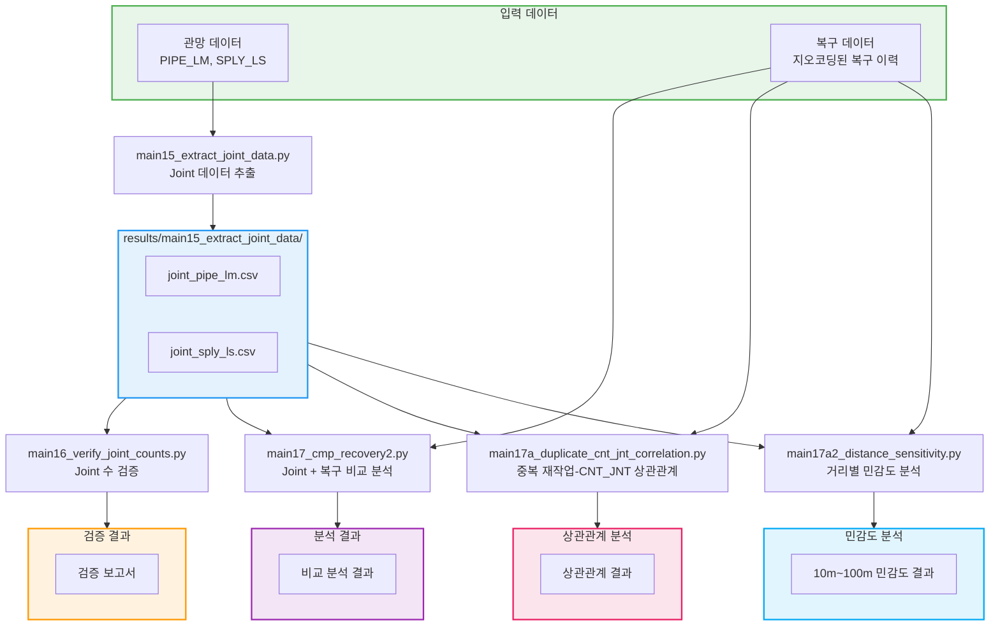

# Joint 분석 파이프라인 (main15-17)

파이프 Joint 데이터 추출, 검증, 복구 작업과의 상관관계 분석 워크플로우입니다.

## 워크플로우 다이어그램



## 실행 순서

### 1단계: Joint 데이터 추출

```bash
python src/main15_extract_joint_data.py
```

### 2단계: Joint 수 검증

```bash
python src/main16_verify_joint_counts.py
```

### 3단계: 복구 작업 비교 분석

```bash
python src/main17_cmp_recovery2.py
```

### 4단계: 상관관계 분석

```bash
# 중복 재작업과 CNT_JNT 상관관계
python src/main17a_duplicate_cnt_jnt_correlation.py

# 거리별 민감도 분석 (10m~100m)
python src/main17a2_distance_sensitivity.py
```

## 입출력 파일 요약

| 스크립트 | 입력 | 출력 |
|---------|------|------|
| main15 | PIPE_LM, SPLY_LS | results/main15_extract_joint_data/*.csv |
| main16 | main15 결과 | 검증 보고서 |
| main17 | Joint 데이터 + 복구 데이터 | 비교 분석 결과 |
| main17a | Joint 데이터 + 복구 데이터 | 상관관계 분석 결과 |
| main17a2 | Joint 데이터 + 복구 데이터 | 거리별 민감도 결과 |

## 관련 문서

- [Joint 연결 수 계산](../joint_calculation.md)
- [main15_extract_joint_data.md](../scripts/main15_extract_joint_data.md)
- [main16_verify_joint_counts.md](../scripts/main16_verify_joint_counts.md)
