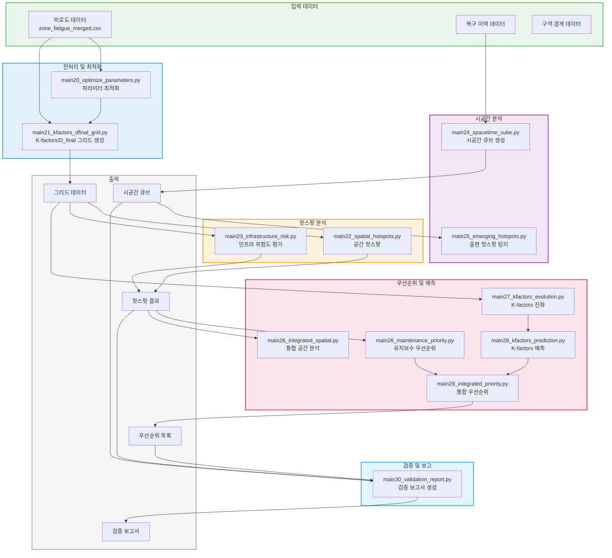

# 공간 통계 분석 파이프라인 (main20-30)

핫스팟 분석, 시공간 큐브, 예측 모델 등 공간 통계 분석 워크플로우입니다.

## 워크플로우 다이어그램



## 실행 순서

### 1단계: 전처리 및 최적화

```bash
# 파라미터 최적화
python src/main20_optimize_parameters.py

# 그리드 생성
python src/main21_kfactors_dfinal_grid.py
```

### 2단계: 핫스팟 분석

```bash
# 공간 핫스팟
python src/main22_spatial_hotspots.py

# 인프라 위험도 평가
python src/main23_infrastructure_risk.py
```

### 3단계: 시공간 분석

```bash
# 시공간 큐브 생성
python src/main24_spacetime_cube.py

# 출현 핫스팟 탐지
python src/main25_emerging_hotspots.py
```

### 4단계: 우선순위 및 예측

```bash
# 유지보수 우선순위
python src/main26_maintenance_priority.py

# 통합 공간 분석
python src/main26_integrated_spatial.py

# K-factors 진화 분석
python src/main27_kfactors_evolution.py

# K-factors 예측
python src/main28_kfactors_prediction.py

# 통합 우선순위
python src/main29_integrated_priority.py
```

### 5단계: 검증 보고서

```bash
python src/main30_validation_report.py
```

## 입출력 파일 요약

| 스크립트 | 입력 | 출력 |
|---------|------|------|
| main20 | 피로도 데이터 | 최적화된 파라미터 |
| main21 | 피로도 데이터 | 그리드 데이터 |
| main22 | 그리드 데이터 | 핫스팟 결과 |
| main23 | 그리드 데이터 | 위험도 평가 결과 |
| main24 | 복구 이력 | 시공간 큐브 |
| main25 | 시공간 큐브 | 출현 핫스팟 |
| main26 | 핫스팟 결과 | 우선순위 목록 |
| main27 | 그리드 데이터 | K-factors 진화 결과 |
| main28 | K-factors 진화 | 예측 결과 |
| main29 | 우선순위 + 예측 | 통합 우선순위 |
| main30 | 모든 분석 결과 | 검증 보고서 |

## 관련 문서

- [공간분석 완료 보고서](../spatial_analysis_completion_report.md)
- [분석 결과 요약](../analysis_results_summary.md)
