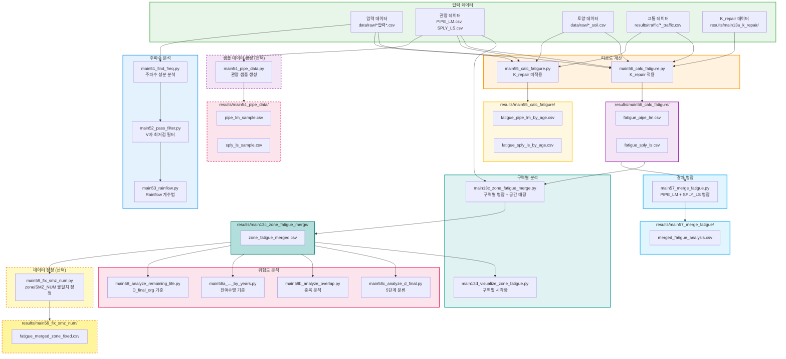

# 시계열/피로도 분석 파이프라인 (main51-58)

압력 데이터의 주파수 분석부터 피로도 계산 및 위험도 분석까지의 워크플로우입니다.

## 워크플로우 다이어그램



## 실행 순서

### 1단계: 주파수 분석 (선택적)

```bash
python src/main51_find_freq.py    # 주파수 성분 분석
python src/main52_pass_filter.py  # V자 최저점 기준 필터링
python src/main53_rainflow.py     # Rainflow 계수법 적용
```

### 2단계: 샘플 데이터 생성 (선택적)

```bash
python src/main54_pipe_data.py    # 관망 샘플 데이터 생성 (테스트/검증용)
```

> **참고**: main54는 선택적입니다. main55/56은 원본 PIPE_LM.csv, SPLY_LS.csv를 직접 읽습니다.

### 3단계: 피로도 계산

```bash
# 택1: K_repair 미적용 버전
python src/main55_calc_fatigure.py

# 택1: K_repair 적용 버전 (권장)
python src/main56_calc_fatigure.py
```

### 4단계: 결과 병합 (2가지 방식)

```bash
# 방식 1: 전체 구역 데이터 병합 (전역 분석용)
python src/main57_merge_fatigue.py

# 방식 2: 구역별 데이터 분리 + 공간 매핑 (구역별 분석용) - 권장
python src/main13c_zone_fatigue_merge.py
python src/main13d_visualize_zone_fatigue.py  # 시각화 (선택)
```

> **참고**: main58 시리즈는 main13c의 결과를 사용합니다.

### 4.5단계: 데이터 정정 (선택적)

```bash
# zone/SMZ_NUM 불일치 정정 (필요 시)
python src/main59_fix_smz_num.py
```

> **참고**: main13c에서 공간 조인으로 결정한 zone과 원본 shapefile의 SMZ_NUM이 불일치하는 경우 정정합니다.
> 전체 4,569개 중 93개 (2.04%) 불일치가 발견되었습니다.

### 5단계: 위험도 분석

```bash
python src/main58_analyze_remaining_life.py      # D_final_org 기준
python src/main58a_analyze_remaining_life_by_years.py  # 잔여수명 기준
python src/main58b_analyze_overlap.py            # 중복 분석
python src/main58c_analyze_d_final.py            # 5단계 분류
```

## 입출력 파일 요약

| 스크립트 | 입력 | 출력 |
|---------|------|------|
| main51 | 압력 데이터 | 주파수 분석 결과 (PNG 그래프) |
| main52 | 압력 데이터 | 필터링된 데이터 (PNG 그래프) |
| main53 | 압력 데이터 | Rainflow 결과 (PNG 그래프, CSV) |
| main54 | data/raw/PIPE_LM.csv<br/>data/raw/SPLY_LS.csv | results/main54_pipe_data/pipe_lm_sample.csv<br/>results/main54_pipe_data/sply_ls_sample.csv |
| main55 | 압력 데이터 + PIPE_LM.csv + SPLY_LS.csv<br/>토양/교통 데이터 | results/main55_calc_fatigure/fatigue_pipe_lm_by_age.csv<br/>results/main55_calc_fatigure/fatigue_sply_ls_by_age.csv |
| main56 | 압력 데이터 + PIPE_LM.csv + SPLY_LS.csv<br/>토양/교통 + K_repair 데이터 | results/main56_calc_fatigure/fatigue_pipe_lm.csv<br/>results/main56_calc_fatigure/fatigue_sply_ls.csv |
| main57 | main56 결과 (fatigue_*.csv) | results/main57_merge_fatigue/merged_fatigue_analysis.csv |
| main13c | main56 결과 + Shapefiles<br/>(PIPE_LM.shp, SPLY_LS.shp, 구역 경계) | results/main13c_zone_fatigue_merge/zone_fatigue_merged.csv |
| main13d | main13c 결과 + Shapefiles | results/main13d_visualize_zone_fatigue/zone_fatigue_map.png |
| main59 | main13c의 zone_fatigue_merged.csv | results/main59_fix_smz_num/fatigue_merged_zone_fixed.csv<br/>results/main59_fix_smz_num/fix_report.txt<br/>results/main59_fix_smz_num/mismatch_ftr_idn_list.csv |
| main58* | main13c의 zone_fatigue_merged.csv | 위험도 분석 보고서 (MD, CSV, PNG) |

## 병합 방식 비교

main56의 피로도 계산 결과를 병합하는 두 가지 방식:

| 구분 | main57 | main13c |
|------|--------|---------|
| **목적** | 전역 분석 | 구역별 분석 |
| **구역 컬럼** | 모든 구역 유지 (0470_D_final, 0480_D_final 등) | 해당 구역만 유지 (D_final로 prefix 제거) |
| **공간 정보** | X | O (zone 컬럼 추가) |
| **Shapefile 조인** | X | O (공간 매칭) |
| **컬럼 수** | 73개 고정 | 가변 (구역별) |
| **사용처** | (향후 전역 분석용) | **main58 시리즈**, main13d |
| **데이터 형식** | Wide-format | Long-format (구역별) |

> **권장**: main58 시리즈를 실행하려면 **main13c**를 사용해야 합니다.

## 관련 문서

- [main55_calc_fatigure.md](../scripts/main55_calc_fatigure.md)
- [main56_calc_fatigure.md](../scripts/main56_calc_fatigure.md)
- [main57_merge_fatigue.md](../scripts/main57_merge_fatigue.md)
- [main13c_zone_fatigue_merge.md](../scripts/main13c_zone_fatigue_merge.md)
- [main13d_visualize_zone_fatigue.md](../scripts/main13d_visualize_zone_fatigue.md)
- [main59_fix_smz_num.md](../scripts/main59_fix_smz_num.md)
- [피로도 계산 공식](../fatigue_calculation_formula.md)
