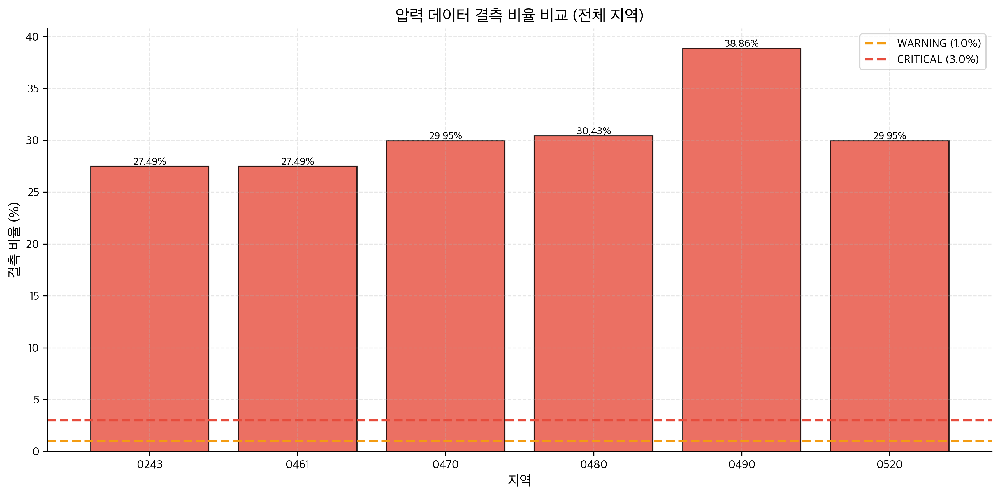
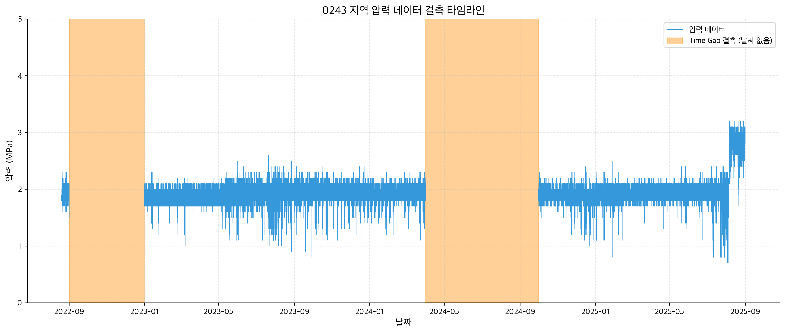
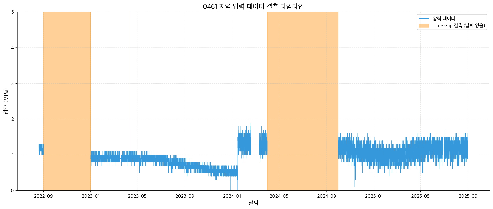
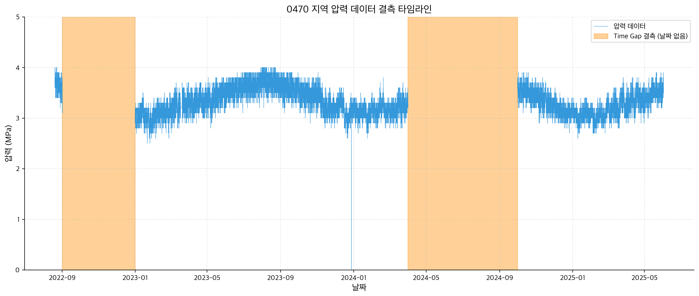
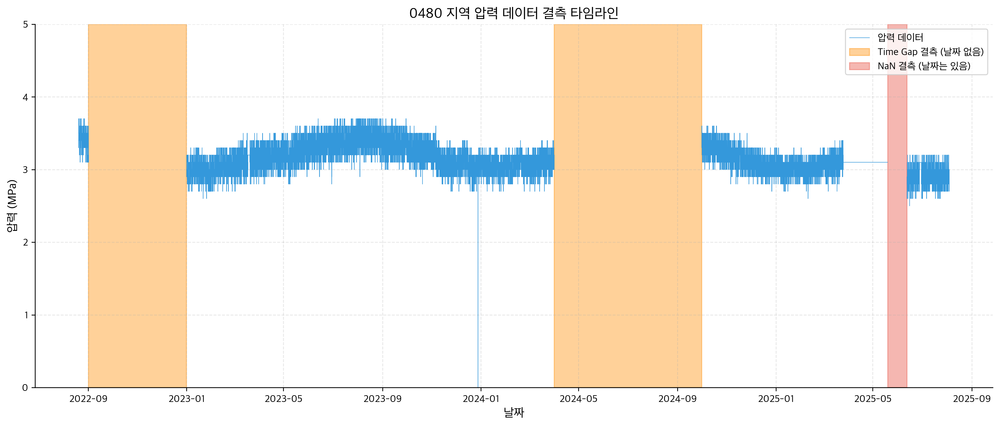
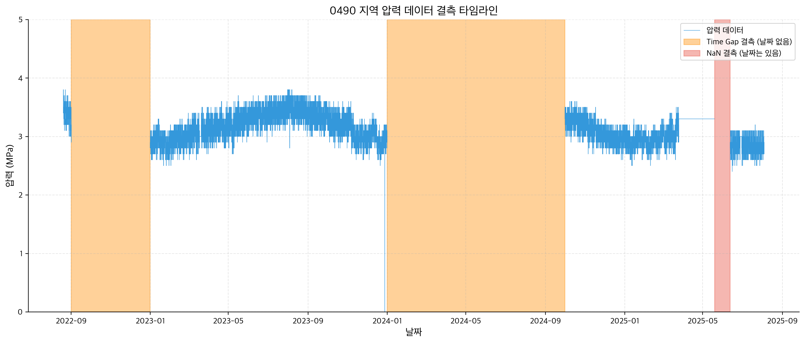
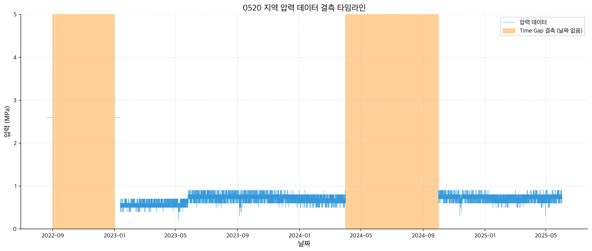
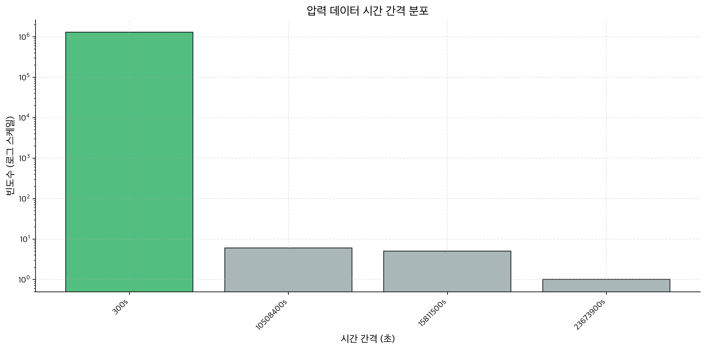

# 압력 데이터 품질 검사 보고서

**생성 일시**: 2025-12-12 18:14:45

---

## 1. Executive Summary

### 분석 개요
- **분석 지역 수**: 6개
- **임계값 설정**:
  - 결측 비율 WARNING: 1.0%
  - 결측 비율 CRITICAL: 3.0%
  - 연속 결측 WARNING: 24시간
  - 연속 결측 CRITICAL: 7일

### 주요 발견사항
- 🔴 CRITICAL: 0243 지역 결측 비율 27.49% (총 87,731개: NaN 0개 + Time Gap 87,731개, 임계값: 3.0%)
- 🔴 CRITICAL: 0243 지역 최대 연속 결측 183.0일 (2024-04-01 ~ 2024-09-30)
- 🔴 CRITICAL: 0461 지역 결측 비율 27.49% (총 87,732개: NaN 1개 + Time Gap 87,731개, 임계값: 3.0%)
- 🔴 CRITICAL: 0461 지역 최대 연속 결측 183.0일 (2024-04-01 ~ 2024-09-30)
- 🔴 CRITICAL: 0470 지역 결측 비율 29.95% (총 87,733개: NaN 2개 + Time Gap 87,731개, 임계값: 3.0%)
- 🔴 CRITICAL: 0470 지역 최대 연속 결측 183.0일 (2024-04-01 ~ 2024-09-30)
- 🔴 CRITICAL: 0480 지역 결측 비율 30.43% (총 94,656개: NaN 6,925개 + Time Gap 87,731개, 임계값: 3.0%)
- 🔴 CRITICAL: 0480 지역 최대 연속 결측 183.0일 (2024-04-01 ~ 2024-09-30)
- 🔴 CRITICAL: 0490 지역 결측 비율 38.86% (총 120,865개: NaN 6,926개 + Time Gap 113,939개, 임계값: 3.0%)
- 🔴 CRITICAL: 0490 지역 최대 연속 결측 274.0일 (2024-01-01 ~ 2024-09-30)
- 🔴 CRITICAL: 0520 지역 결측 비율 29.95% (총 87,734개: NaN 3개 + Time Gap 87,731개, 임계값: 3.0%)
- 🔴 CRITICAL: 0520 지역 최대 연속 결측 183.0일 (2024-04-01 ~ 2024-09-30)

---

## 2. 결측치 분석 결과

### 결측 데이터 정의
- **NaN 결측**: 원본 CSV에 행은 있지만 압력값(wtrprsr)이 NaN인 경우
- **Time Gap 결측**: 5분 간격이 빠진 시간대 (행 자체가 없음)
- **총 결측**: NaN 결측 + Time Gap 결측

### 지역별 결측 통계

| 지역 | 원본 레코드 | 예상 레코드 | NaN 결측 | Time Gap 결측 | 총 결측 | 결측 비율 | 최대 연속 결측 |
|------|-------------|-------------|----------|---------------|---------|-----------|----------------|
| 0243 | 231,372 | 319,103 | 0 | 87,731 | 87,731 | 27.493% | 4391.9시간 |
| 0461 | 231,372 | 319,103 | 1 | 87,731 | 87,732 | 27.493% | 4391.9시간 |
| 0470 | 205,164 | 292,895 | 2 | 87,731 | 87,733 | 29.954% | 4391.9시간 |
| 0480 | 223,308 | 311,039 | 6,925 | 87,731 | 94,656 | 30.432% | 4391.9시간 |
| 0490 | 197,100 | 311,039 | 6,926 | 113,939 | 120,865 | 38.858% | 6575.9시간 |
| 0520 | 205,164 | 292,895 | 3 | 87,731 | 87,734 | 29.954% | 4391.9시간 |

### 연속 결측 구간 상세

**0243 지역** (2개 구간):
1. 2022-09-01 09:05 ~ 2022-12-31 23:55 (2918.8시간, 35027개)
2. 2024-04-01 00:00 ~ 2024-09-30 23:55 (4391.9시간, 52704개)

**0461 지역** (2개 구간):
1. 2022-09-01 09:05 ~ 2022-12-31 23:55 (2918.8시간, 35027개)
2. 2024-04-01 00:00 ~ 2024-09-30 23:55 (4391.9시간, 52704개)

**0470 지역** (2개 구간):
1. 2022-09-01 09:05 ~ 2022-12-31 23:55 (2918.8시간, 35027개)
2. 2024-04-01 00:00 ~ 2024-09-30 23:55 (4391.9시간, 52704개)

**0480 지역** (3개 구간):
1. 2022-09-01 09:05 ~ 2022-12-31 23:55 (2918.8시간, 35027개)
2. 2024-04-01 00:00 ~ 2024-09-30 23:55 (4391.9시간, 52704개)
3. 2025-05-19 13:40 ~ 2025-06-12 14:40 (577.0시간, 6925개)

**0490 지역** (3개 구간):
1. 2022-09-01 09:05 ~ 2022-12-31 23:55 (2918.8시간, 35027개)
2. 2024-01-01 00:00 ~ 2024-09-30 23:55 (6575.9시간, 78912개)
3. 2025-05-19 13:40 ~ 2025-06-12 14:45 (577.1시간, 6926개)

**0520 지역** (2개 구간):
1. 2022-09-01 09:05 ~ 2022-12-31 23:55 (2918.8시간, 35027개)
2. 2024-04-01 00:00 ~ 2024-09-30 23:55 (4391.9시간, 52704개)

---

## 3. 시간 간격 검증 결과

| 지역 | 중복 타임스탬프 | 시간 순서 역전 | 불규칙 간격 |
|------|-----------------|----------------|-------------|
| 0243 | 0 | ✅ No | 2 |
| 0461 | 0 | ✅ No | 2 |
| 0470 | 0 | ✅ No | 2 |
| 0480 | 0 | ✅ No | 2 |
| 0490 | 0 | ✅ No | 2 |
| 0520 | 0 | ✅ No | 2 |

---

## 4. 경고 및 권장사항

### 경고 메시지
- 🔴 CRITICAL: 0243 지역 결측 비율 27.49% (총 87,731개: NaN 0개 + Time Gap 87,731개, 임계값: 3.0%)
- 🔴 CRITICAL: 0243 지역 최대 연속 결측 183.0일 (2024-04-01 ~ 2024-09-30)
- 🔴 CRITICAL: 0461 지역 결측 비율 27.49% (총 87,732개: NaN 1개 + Time Gap 87,731개, 임계값: 3.0%)
- 🔴 CRITICAL: 0461 지역 최대 연속 결측 183.0일 (2024-04-01 ~ 2024-09-30)
- 🔴 CRITICAL: 0470 지역 결측 비율 29.95% (총 87,733개: NaN 2개 + Time Gap 87,731개, 임계값: 3.0%)
- 🔴 CRITICAL: 0470 지역 최대 연속 결측 183.0일 (2024-04-01 ~ 2024-09-30)
- 🔴 CRITICAL: 0480 지역 결측 비율 30.43% (총 94,656개: NaN 6,925개 + Time Gap 87,731개, 임계값: 3.0%)
- 🔴 CRITICAL: 0480 지역 최대 연속 결측 183.0일 (2024-04-01 ~ 2024-09-30)
- 🔴 CRITICAL: 0490 지역 결측 비율 38.86% (총 120,865개: NaN 6,926개 + Time Gap 113,939개, 임계값: 3.0%)
- 🔴 CRITICAL: 0490 지역 최대 연속 결측 274.0일 (2024-01-01 ~ 2024-09-30)
- 🔴 CRITICAL: 0520 지역 결측 비율 29.95% (총 87,734개: NaN 3개 + Time Gap 87,731개, 임계값: 3.0%)
- 🔴 CRITICAL: 0520 지역 최대 연속 결측 183.0일 (2024-04-01 ~ 2024-09-30)

### 지역별 권장 조치사항

**0243 지역**:
- 🔴 time 또는 spline 보간 검토 필요.
-    - 연속 결측 구간이 긴 경우, 해당 기간을 분석에서 제외하는 것을 권장
-    - main20-30 공간 분석 시 해당 지역 가중치 낮춤 고려

**0461 지역**:
- 🔴 time 또는 spline 보간 검토 필요.
-    - 연속 결측 구간이 긴 경우, 해당 기간을 분석에서 제외하는 것을 권장
-    - main20-30 공간 분석 시 해당 지역 가중치 낮춤 고려

**0470 지역**:
- 🔴 time 또는 spline 보간 검토 필요.
-    - 연속 결측 구간이 긴 경우, 해당 기간을 분석에서 제외하는 것을 권장
-    - main20-30 공간 분석 시 해당 지역 가중치 낮춤 고려

**0480 지역**:
- 🔴 time 또는 spline 보간 검토 필요.
-    - 연속 결측 구간이 긴 경우, 해당 기간을 분석에서 제외하는 것을 권장
-    - main20-30 공간 분석 시 해당 지역 가중치 낮춤 고려

**0490 지역**:
- 🔴 time 또는 spline 보간 검토 필요.
-    - 연속 결측 구간이 긴 경우, 해당 기간을 분석에서 제외하는 것을 권장
-    - main20-30 공간 분석 시 해당 지역 가중치 낮춤 고려

**0520 지역**:
- 🔴 time 또는 spline 보간 검토 필요.
-    - 연속 결측 구간이 긴 경우, 해당 기간을 분석에서 제외하는 것을 권장
-    - main20-30 공간 분석 시 해당 지역 가중치 낮춤 고려

---

## 5. 첨부 차트

### 결측 비율 비교

### 결측 타임라인 (전체 지역)

**0243 지역**:

**0461 지역**:

**0470 지역**:

**0480 지역**:

**0490 지역**:

**0520 지역**:

### 시간 간격 분포

---

**보고서 종료**
