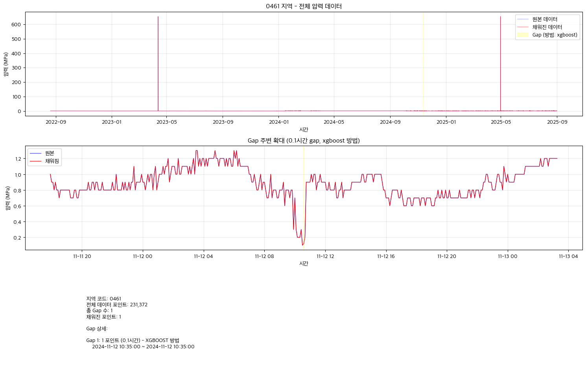
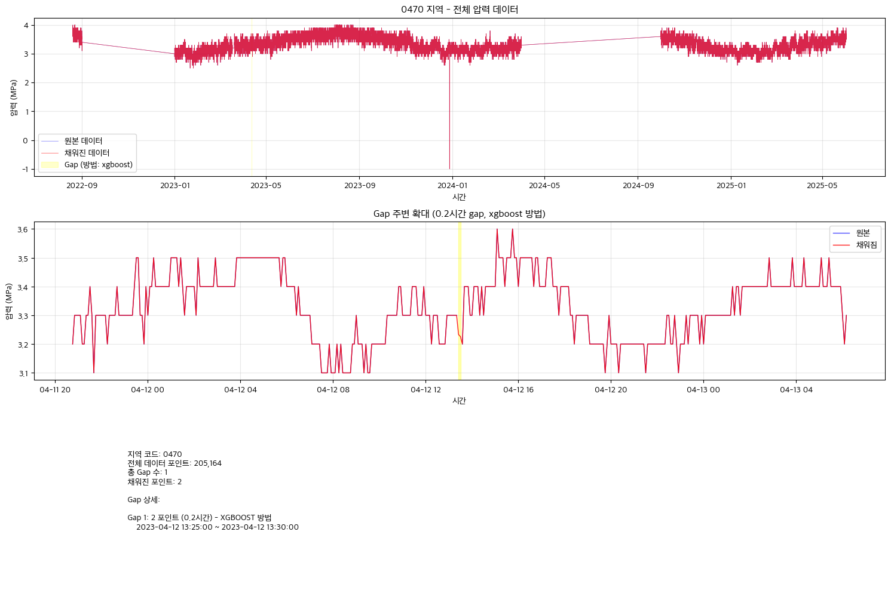
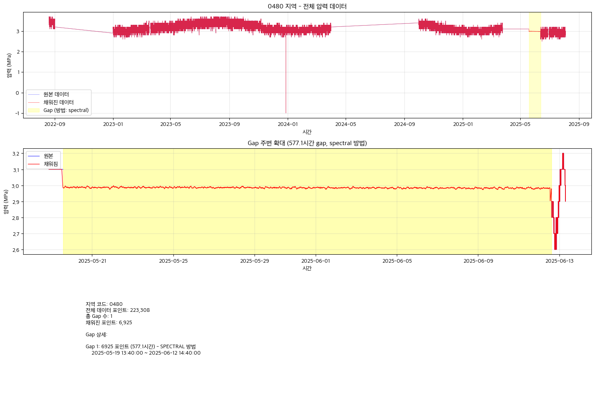
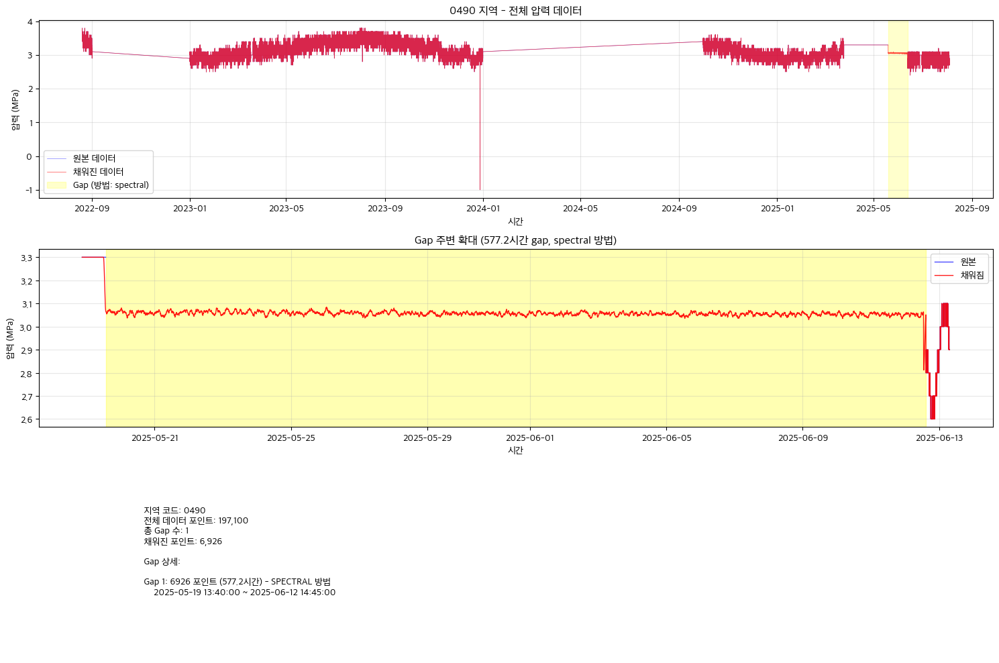
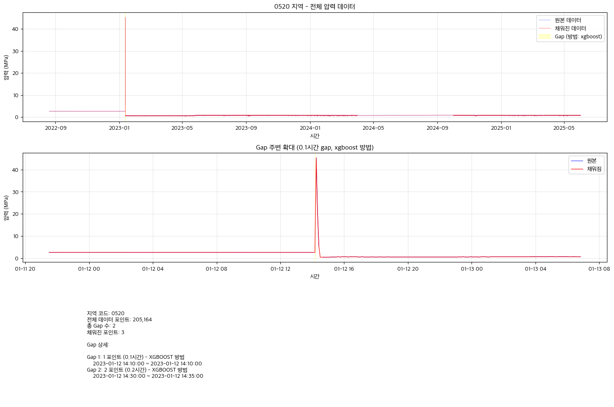

# 압력 데이터 Gap Filling 보고서

**생성 일시**: 2025-12-12 14:46:32
**처리 스크립트**: main41_fill_pressure_gaps.py

---

## 1. 요약

- **전체 지역**: 6개
- **처리된 지역**: 6개
- **발견된 Gap**: 6개
- **XGBoost 방법**: 4개 gap
- **Spectral 방법**: 2개 gap

---

## 2. 지역별 상세

### 0243 지역

- **상태**: ✅ Gap 없음 (데이터 완전)

### 0461 지역

- **상태**: ✅ 1개 gap 처리 완료
- **Gap 상세**:

| Gap # | 포인트 수 | 시간 (h) | 방법 | 시작 시간 | 종료 시간 |
|-------|----------|---------|------|-----------|----------|
| 1 | 1 | 0.1 | XGBOOST | 2024-11-12 10:35:00 | 2024-11-12 10:35:00 |

### 0470 지역

- **상태**: ✅ 1개 gap 처리 완료
- **Gap 상세**:

| Gap # | 포인트 수 | 시간 (h) | 방법 | 시작 시간 | 종료 시간 |
|-------|----------|---------|------|-----------|----------|
| 1 | 2 | 0.2 | XGBOOST | 2023-04-12 13:25:00 | 2023-04-12 13:30:00 |

### 0480 지역

- **상태**: ✅ 1개 gap 처리 완료
- **Gap 상세**:

| Gap # | 포인트 수 | 시간 (h) | 방법 | 시작 시간 | 종료 시간 |
|-------|----------|---------|------|-----------|----------|
| 1 | 6925 | 577.1 | SPECTRAL | 2025-05-19 13:40:00 | 2025-06-12 14:40:00 |

### 0490 지역

- **상태**: ✅ 1개 gap 처리 완료
- **Gap 상세**:

| Gap # | 포인트 수 | 시간 (h) | 방법 | 시작 시간 | 종료 시간 |
|-------|----------|---------|------|-----------|----------|
| 1 | 6926 | 577.2 | SPECTRAL | 2025-05-19 13:40:00 | 2025-06-12 14:45:00 |

### 0520 지역

- **상태**: ✅ 2개 gap 처리 완료
- **Gap 상세**:

| Gap # | 포인트 수 | 시간 (h) | 방법 | 시작 시간 | 종료 시간 |
|-------|----------|---------|------|-----------|----------|
| 1 | 1 | 0.1 | XGBOOST | 2023-01-12 14:10:00 | 2023-01-12 14:10:00 |
| 2 | 2 | 0.2 | XGBOOST | 2023-01-12 14:30:00 | 2023-01-12 14:35:00 |

---

## 3. 처리 방법 설명

### XGBoost (≤ 1시간 gap)
- 기계학습 기반 시계열 예측
- 주변 데이터의 패턴을 학습하여 정확한 예측
- 짧은 gap에 효과적

### Spectral (> 1시간 gap)
- Component-wise 주파수 도메인 접근
- Butterworth 필터로 저/고주파 분리
- 저주파: ARMA 모델, 고주파: Random Phase IFFT
- 긴 gap에서도 시계열 특성 유지

---

## 4. 다음 단계

1. **main51_find_freq.py** 실행하여 주파수 분석
2. **main52-57** 피로 분석 파이프라인 실행
3. Gap이 채워진 기간의 피로 분석 결과 신뢰도 검토

---

**보고서 종료**
