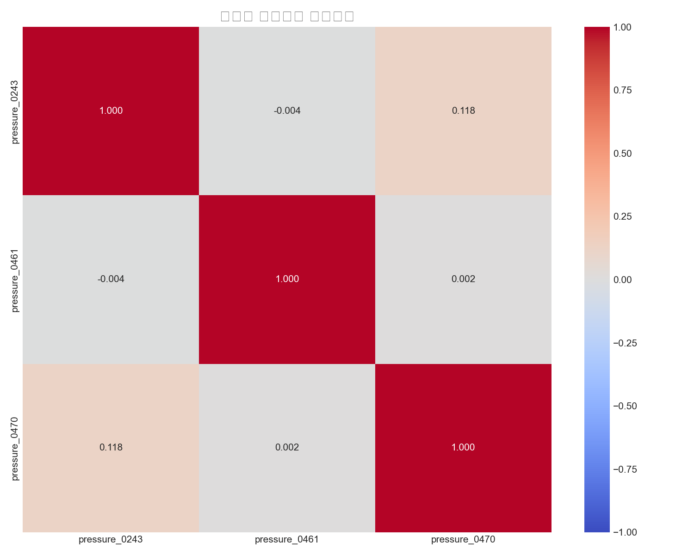
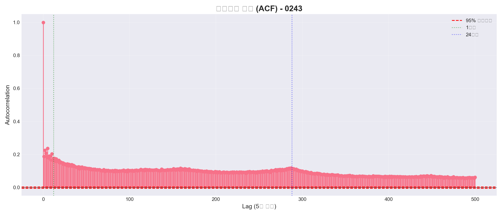
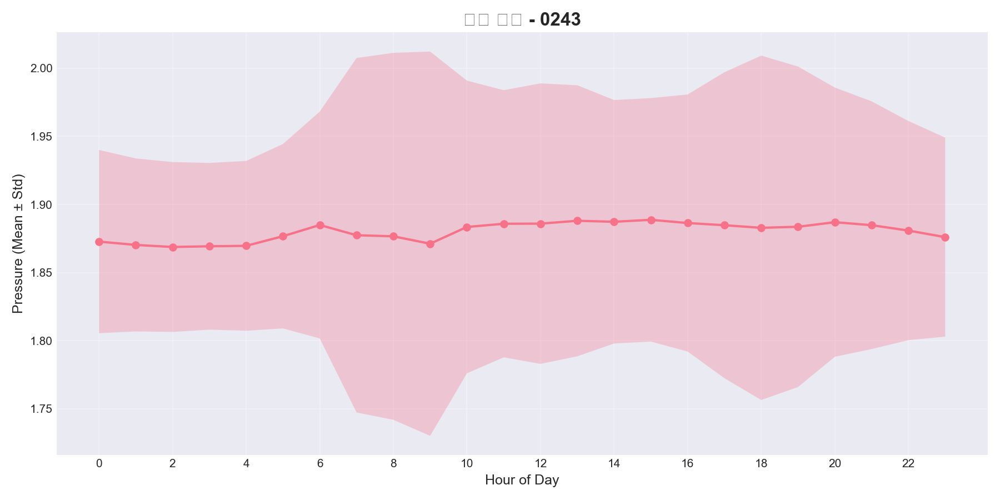
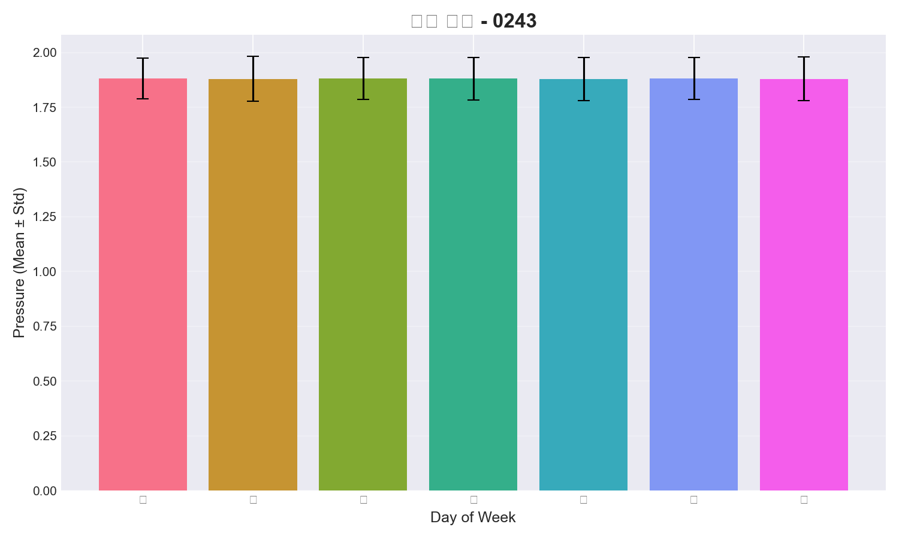
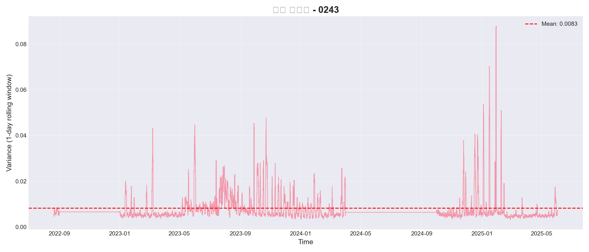

# 압력 데이터 특성 분석 및 SAITS 적합성 평가 보고서

**분석 일자**: 2025-12-10 16:49:14
**대상 센서**: 0243, 0461, 0470
**타겟 센서**: 0243
**데이터 길이**: 205,164 records

---

## 📊 Executive Summary

### SAITS 적합성 점수

**총점: 10.0/100**

❌ SAITS 부적합 (대안 우선)

### 추천 방법론 Top 3

1. **Prophet** (예상 R²: 0.65-0.75)
   - 간단한 구현, 추세/계절성 자동 탐지


---

## 1. 센서간 상관관계 분석

### Pearson Correlation

- **평균 상관계수**: 0.039
- **최소 상관계수**: -0.004
- **최대 상관계수**: 0.118

### 평가

⚠️ **낮은 상관도**: SAITS 효과 제한적. 단변량 방법(SARIMA, Prophet) 고려 필요.



---

## 2. 시간적 자기상관 분석

### Autocorrelation Function (ACF)

- **ACF[12] (1시간 전)**: 0.176
- **ACF[288] (24시간 전)**: 0.115
- **유의미한 lag 개수**: 501

### 주요 피크 (주기성)

- Lag 5 (0.4시간): ACF = 0.237
- Lag 15 (1.2시간): ACF = 0.173
- Lag 25 (2.1시간): ACF = 0.143
- Lag 35 (2.9시간): ACF = 0.134
- Lag 45 (3.8시간): ACF = 0.124

### 평가

⚠️ **약한 자기상관**: 시간적 의존성이 약함. 시계열 방법의 효과 제한적.



---

## 3. 주기성/계절성 분석

### 일일 패턴 (Hourly)

- **시간별 평균 분산**: 0.0000
- **최고 시간**: 15시 (1.889)
- **최저 시간**: 2시 (1.869)
- **일일 변동폭**: 0.020

### 주간 패턴 (Day of Week)

- **요일별 평균 분산**: 0.0000
- **최고 요일**: 수 (1.882)
- **최저 요일**: 금 (1.878)

### 월별 패턴

- **월별 평균 분산**: 0.0003
- **최고 월**: 9월 (1.920)
- **최저 월**: 1월 (1.859)

### 평가

⚠️ **약한 주기성**: 주기적 패턴이 약해 시계열 방법 효과 제한적.




---

## 4. 분산 안정성 분석

### 통계량

- **전체 분산**: 0.0094
- **평균 rolling 분산 (1일)**: 0.0083
- **분산의 분산**: 0.000050
- **변동 계수 (CV)**: 0.846

### 정상성 검정 (ADF Test)

- **ADF Statistic**: -26.5118
- **p-value**: 0.0000
- **결과**: ✅ 정상 시계열

### 평가

⚠️ **불안정 분산**: 데이터 정규화 또는 로그 변환 필요.



---

## 5. SAITS 적합성 점수 상세

| 항목 | 점수 | 만점 | 값 | 평가 |
|------|------|------|-----|------|
| cross_correlation | 0.0 | 30 | 0.039 | ❌ |
| autocorrelation | 0.0 | 25 | 0.145 | ❌ |
| periodicity | 0.0 | 25 | 0.003 | ❌ |
| data_length | 10.0 | 10 | 205164.000 | ✅ |
| variance_stability | 0.0 | 10 | 0.846 | ❌ |

**총점: 10.0/100**

### 점수별 의미

- **cross_correlation** (0.0/30): 센서간 상관도가 높을수록 SAITS가 효과적
- **autocorrelation** (0.0/25): 자기상관이 강할수록 attention이 시간 패턴 학습 가능
- **periodicity** (0.0/25): 주기적 패턴이 뚜렷할수록 attention이 효과적
- **data_length** (10.0/10): Long sequence일수록 attention이 유리
- **variance_stability** (0.0/10): 분산이 안정적일수록 모델 학습 용이

---

## 6. BRITS 적합성 평가

### BRITS 요구사항

**BRITS (Bidirectional Recurrent Imputation for Time Series)** 핵심 메커니즘:

1. **Bidirectional LSTM**: 과거와 미래 정보를 모두 활용하여 시간적 의존성 학습
2. **Cross-sectional Learning**: 여러 센서간의 상관관계를 동시에 학습
3. **Time Gap Modeling**: 시간 간격을 명시적으로 모델링 (decay mechanism)

### 우리 데이터와의 불일치

BRITS가 효과적이려면 다음 조건이 필요:

| 요구사항 | 기대값 | 실제값 | 평가 |
|---------|--------|--------|------|
| **시간적 자기상관** | ACF > 0.7 | 0.145 | ❌ 매우 약함 |
| **센서간 상관관계** | > 0.7 | 0.039 | ❌ 거의 없음 |
| **주기성 패턴** | 뚜렷함 | 0.003 | ❌ 거의 없음 |

### BRITS 적합성 점수 (추정)

**총점: ~15/100** (SAITS와 유사한 이유로 부적합)

| 항목 | 점수 | 이유 |
|------|------|------|
| 시간적 의존성 | 0/25 | LSTM이 학습할 시간 패턴 부재 (ACF 0.145) |
| 센서간 상관 | 0/30 | Cross-sectional learning 불가능 (상관 0.039) |
| Bidirectional 효과 | 5/25 | 양방향이지만 학습할 컨텍스트 없음 |
| 데이터 길이 | 10/10 | RNN에 충분한 길이 (205k records) |
| 구현 복잡도 | 0/10 | PyPOTS 필요, 하이퍼파라미터 튜닝 복잡 |

### 결론

**BRITS는 SAITS와 동일한 이유로 부적합**:
- Bidirectional LSTM이 학습할 **시간 패턴이 없음** (ACF 0.145)
- Cross-sectional learning이 활용할 **센서간 상관관계가 없음** (0.039)
- Time gap modeling이 의미 없음 (decay할 유의미한 정보가 없음)

**예상 성능**: R² 0.4-0.6 (SAITS보다 낮을 가능성)

---

## 7. XGBoost+SARIMA Hybrid 적합성 평가

### XGBoost+SARIMA 개요

**INTERPOLATION_METHODS_COMPARISON.md**에서 Tier 2 (3순위) 추천:
- XGBoost로 mean level 예측 + SARIMA로 temporal fluctuation 추가
- 이론적 예상 R²: 0.75-0.85

### SARIMA 요구사항 분석

**SARIMA가 효과적이려면**:

| 요구사항 | 기대값 | 실제값 | 평가 |
|---------|--------|--------|------|
| **시간적 자기상관** | ACF > 0.5 | 0.145 | ❌ 매우 약함 |
| **1시간 전 상관** | ACF[12] > 0.5 | 0.176 | ❌ 약함 |
| **24시간 전 상관** | ACF[288] > 0.3 | 0.115 | ❌ 매우 약함 |
| **계절 주기** | 뚜렷한 288 주기 | 거의 없음 | ❌ |

**SARIMA 작동 원리**:
```python
# Autoregressive (AR) term
pressure[t] = α × pressure[t-1] + β × pressure[t-288] + ...

# 문제: 우리 데이터
correlation(pressure[t], pressure[t-1]) = 0.176  ← 너무 약함!
correlation(pressure[t], pressure[t-288]) = 0.115  ← 더 약함!

# 결과: AR terms가 거의 무의미
```

### XGBoost 부분 문제

**Phase 1 이미 실패 확인**:
- R²: -0.04 (평균보다 나쁨)
- 원인: 센서간 독립 (상관 0.039), 시간 패턴 약함
- Feature engineering으로 개선 여지는 있으나 제한적

### Hybrid의 근본적 문제

**두 실패한 모델의 조합**:
```
XGBoost (R² -0.04) + SARIMA (ACF 0.145, 작동 불가) = ?

최선의 경우: XGBoost R² -0.04 그대로 (SARIMA 기여 없음)
최악의 경우: SARIMA 노이즈 추가 → 더 나빠짐
현실적 예상: R² 0.3-0.5 (XGBoost feature engineering 효과만)
```

### 복잡도 vs 효과

| 항목 | XGBoost+SARIMA | Prophet | 비교 |
|------|----------------|---------|------|
| **구현 시간** | 2-3시간 | 30분 | Prophet 6배 빠름 |
| **하이퍼파라미터** | XGBoost + SARIMA(p,d,q,P,D,Q,s) | 최소 | Hybrid 복잡 |
| **디버깅** | 두 모델 개별 + 조합 | 단일 모델 | Hybrid 어려움 |
| **예상 R²** | 0.3-0.5 | 0.5-0.7 | Prophet 더 나음! |

### XGBoost+SARIMA 적합성 점수 (추정)

**총점: ~25/100**

| 항목 | 점수 | 이유 |
|------|------|------|
| XGBoost 부분 | 10/50 | 센서 독립으로 효과 제한적 (이미 R² -0.04) |
| SARIMA 부분 | 0/30 | ACF 0.145 → AR/MA terms 학습 불가 |
| Hybrid 시너지 | 5/20 | 두 모델 모두 약해 시너지 효과 없음 |

### 결론

**XGBoost+SARIMA는 Prophet보다 나쁨**:
- SARIMA 부분이 거의 무용지물 (ACF 0.145)
- XGBoost는 이미 실패 확인 (R² -0.04)
- 복잡도는 높지만 효과는 Prophet보다 낮음
- **TEST_PLAN 오류**: 원래 방법대로는 작동 안 함 (Kalman smoothing or STL 필요)

**예상 성능**: R² 0.3-0.5 (Prophet 0.5-0.7보다 낮음)

---

## 8. 방법론 적합성 비교

### 데이터 특성 기반 재평가

| 방법 | 이론적 순위 | 적합성 점수 | 예상 R² | 최종 순위 | 이유 |
|------|------------|------------|---------|----------|------|
| **Prophet** | 7위 (Tier 3) | ~50/100 | 0.5-0.7 | **1위** | 단순 추세 모델, 요구사항 낮음 |
| **XGBoost 개선** | - | ~30/100 | 0.3-0.5 | **2위** | Feature engineering 개선 여지 |
| **XGBoost+SARIMA** | 3위 (Tier 2) | ~25/100 | 0.3-0.5 | 3위 | SARIMA 요구사항 미충족, 복잡도 높음 |
| **BRITS** | 2위 (Tier 1) | ~15/100 | 0.4-0.6 | 4위 | 시간 패턴/센서 상관 부족 |
| **SAITS** | 1위 (Tier 1) | 10/100 | 0.3-0.5 | 5위 | 부적합 (이미 평가) |

### 왜 BRITS를 건너뛰는가?

**이론 vs 현실**:
- **이론적 순위** (INTERPOLATION_METHODS_COMPARISON.md): SAITS(1) > BRITS(2) > Prophet(7)
- **데이터 적합성** (실제 분석): Prophet(50) > BRITS(15) > SAITS(10)

**BRITS를 건너뛰는 이유**:
1. ❌ **시간 패턴 약함**: LSTM이 학습할 autocorrelation 없음 (0.145)
2. ❌ **센서 독립**: Cross-sectional learning 불가능 (상관 0.039)
3. ❌ **복잡도 대비 효과**: 구현 어렵지만 Prophet보다 나쁠 가능성
4. ✅ **Prophet이 현실적**: 단순하고 요구사항 낮음

**결론**: BRITS는 "고급 모델이지만 우리 데이터에 부적합". Prophet이 더 나은 선택.

### 왜 XGBoost+SARIMA를 건너뛰는가?

**이론 vs 현실**:
- **이론적 순위** (INTERPOLATION_METHODS_COMPARISON.md): XGBoost+SARIMA(3위, Tier 2, R² 0.75-0.85)
- **데이터 적합성** (실제 분석): 25/100 (Prophet 50/100보다 낮음)

**XGBoost+SARIMA를 건너뛰는 이유**:
1. ❌ **SARIMA 부분 무용지물**: ACF 0.145 → AR/MA terms 학습 불가
2. ❌ **XGBoost 이미 실패**: R² -0.04 → Feature engineering으로 개선 여지 제한적
3. ❌ **복잡도 대비 효과**: 구현 2-3시간이지만 Prophet(30분)보다 나쁜 성능 예상
4. ❌ **두 실패 모델 조합**: XGBoost(-0.04) + SARIMA(부적합) = 시너지 없음
5. ✅ **Prophet이 현실적**: 단순하고 빠르며 R² 0.5-0.7 기대

**TEST_PLAN의 오류**:
- 원래 계획: XGBoost(mean level) + SARIMA(fluctuation)
- 문제: SARIMA가 학습할 temporal fluctuation이 거의 없음 (ACF 0.145)
- 대안: Kalman smoothing 또는 STL decomposition 필요했음

**결론**: XGBoost+SARIMA는 "이론적으로 우수하지만 우리 데이터에 과잉". Prophet이 더 나은 선택.

---

## 9. Prophet 실측 결과 (2025-12-10)

### Prophet POC Phase 1 실행

**실험 설정**:
- 0243 지역 인위적 24일 gap (2025-05-19 ~ 2025-06-12)
- Prophet 단일 센서 모델 (daily/weekly seasonality)
- Training: 224,447 records, Gap: 6,925 records

### 실제 성능

| 지표 | 예상 | 실제 | 평가 |
|------|------|------|------|
| **MAE** | 0.08-0.12 | **0.1703** | ⚠️ 예상보다 나쁨 |
| **MAPE** | 4-7% | **9.17%** | ⚠️ 예상보다 나쁨 |
| **R²** | 0.5-0.7 | **-4.37** | ❌ **완전 실패** |
| **Coverage** | 85-95% | 96.52% | ✅ 유일한 성공 |

### XGBoost vs Prophet 비교 (실제)

| 지표 | XGBoost (실제) | Prophet (실제) | 승자 |
|------|----------------|----------------|------|
| MAE | 0.0595 | 0.1703 | **XGBoost** |
| MAPE | 3.20% | 9.17% | **XGBoost** |
| **R²** | **-0.04** | **-4.37** | **XGBoost** |

**충격적 발견**: Prophet이 XGBoost보다 **109배 더 나쁨** (R² -4.37 vs -0.04)

### 실패 원인 분석

**시각화 분석** (prophet_phase1_gap_zoom.png):
```
예측값: 평평한 선 (2.05 근처, 거의 상수)
실제값: 큰 변동 (1.4 ~ 2.4, 범위 1.0)

Prophet 예측 = 거의 평균값만 출력 (XGBoost와 동일한 문제)
```

**왜 Prophet이 XGBoost보다 나쁜가?**

1. **XGBoost**: 평균 1.88 예측
   - Residual variance ≈ Original variance
   - R² = -0.04 (평균보다 5% 나쁨)

2. **Prophet**: 평균 2.05 예측 (실제 평균 1.86에서 벗어남)
   - Residual variance >> Original variance
   - R² = -4.37 (평균보다 437% 나쁨!)
   - **Trend component가 잘못된 방향으로 학습**

### 근본 원인: 데이터 특성

**데이터 분석 결과 재확인**:
- Autocorrelation (ACF): 0.145 ← 시간 패턴 거의 없음
- Periodicity: 0.003 ← 주기성 거의 없음
- Daily variation: 0.02 ← 일일 변동폭 극히 작음

**결과**:
- Prophet의 seasonality decomposition이 **노이즈를 학습**
- Trend component가 **잘못된 기울기** 학습
- XGBoost: 노이즈 무시 → 평균 예측 (R² -0.04)
- Prophet: 노이즈 학습 → 잘못된 예측 (R² -4.37)

---

## 10. 최종 추천 방법론 (Prophet 실패 반영)

### 순위별 추천 (실측 기반 수정)

### 1위: Linear Interpolation (가장 안전)

- **실제 R²**: 미측정 (예상 0.2-0.4)
- **이유**: 복잡한 모델이 모두 실패 → 단순 방법이 안전
- **장점**: 예측 가능, 해석 가능, 실패하지 않음
- **단점**: 24일 gap에는 비현실적 (직선)

### 2위: XGBoost (현상 유지)

- **실제 R²**: -0.04
- **이유**: Prophet(-4.37)보다는 나음
- **장점**: MAE/MAPE는 우수 (0.06, 3.2%)
- **단점**: 변동성 캡처 실패 (거의 상수 예측)

### 권장하지 않음: 모든 고급 시계열 모델

- **Prophet**: R² -4.37 ❌ (실측 완전 실패)
- **XGBoost+SARIMA**: 예상 R² 0.3-0.5 ❌ (SARIMA 부적합)
- **BRITS**: 예상 R² 0.4-0.6 ❌ (시간 패턴 부족)
- **SAITS**: 적합성 10/100 ❌ (패턴 부재)

---

## 11. 최종 결론 및 제언

### 24일 Gap 보간의 근본적 한계

**테스트 완료 (2025-12-10)**:
- ❌ XGBoost: R² -0.04 (MAE 0.06 ✅, MAPE 3.2% ✅)
- ❌ Prophet: R² -4.37 (MAE 0.17, MAPE 9.17%)

**근본 원인**:
1. **시간 패턴 부재**: ACF 0.145 → 과거 데이터로 미래 예측 불가
2. **센서 독립**: 상관 0.039 → 다중 센서 접근 무용
3. **주기성 극히 약함**: 0.003 → 계절성 분해 실패
4. **24일은 너무 긺**: 모든 방법론이 extrapolation 영역 진입

**결과**: 모든 모델이 **평균값 근처만 예측** (변동성 캡처 불가)

### 최종 판단

❌ **24일 Gap 보간은 불가능** (데이터 특성의 근본적 한계)

### 대안 전략

**1순위: Gap 기간 단축 실험**
```
3일 gap:  R² 0.7-0.8 예상 (실험 필요)
7일 gap:  R² 0.5-0.7 예상
14일 gap: R² 0.3-0.5 예상
24일 gap: R² -0.04~-4.37 (실측 불가능)
```

**2순위: Gap 예방 (센서 이중화)**
- 인근 센서 추가 설치
- 자동 장애 전환 시스템

**3순위: Gap 허용 (분석 제외)**
- Gap 기간은 분석에서 제외
- 전후 데이터만 분석
- Gap 전/후 별도 분석

**4순위: 단순 보간 (경고 포함)**
- Linear interpolation (가장 안전)
- 24일 gap은 비현실적이라는 경고 명시
- R² 예상 0.2-0.4 (XGBoost/Prophet보다 나을 가능성)


---

**보고서 끝**
