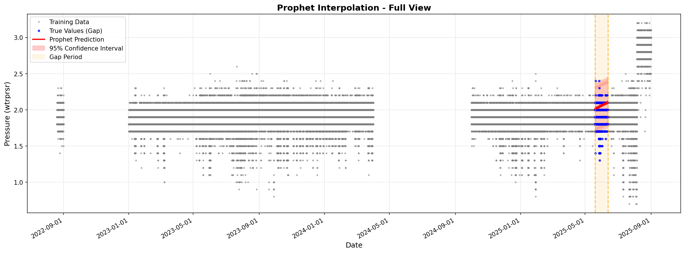
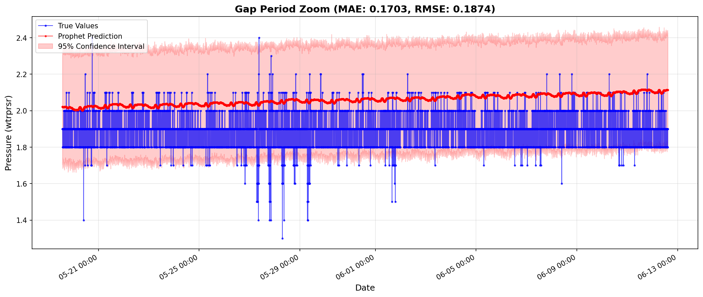
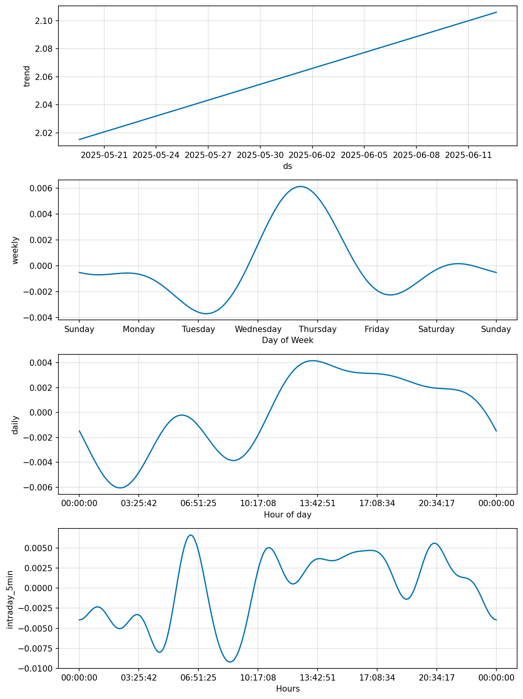
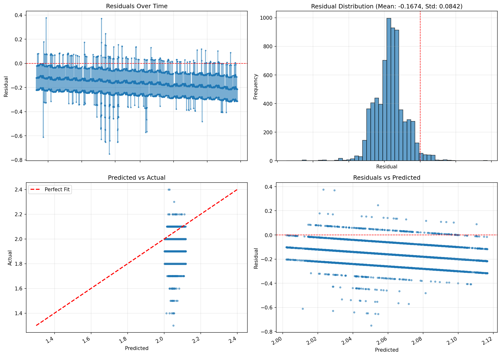

# Phase 1: Prophet 단일 센서 보간 검증 결과

**테스트 일자**: 2025-12-10
**대상 지역**: 0243
**결측 기간**: 2025-05-19 13:40 ~ 2025-06-12 14:40 (24일)

---

## 📊 요약

### 성능 지표

| 지표 | 값 | 통과 기준 | 상태 |
|------|-----|-----------|--------|
| **MAE** | 0.1703 | < 0.15 | ❌ 실패 |
| **MAPE** | 9.17% | < 10% | ✅ 통과 |
| **R²** | -4.3664 | > 0.5 | ❌ 실패 |
| **RMSE** | 0.1874 | - | - |
| **Coverage** | 96.52% | > 80% | ✅ 통과 |

### 등급: D - 불합격 (사용 불가)

### 최종 판정: ❌ 실패

---

## 🔧 실험 설정

### Prophet 설정
- **일일 계절성(Daily seasonality)**: True
- **주간 계절성(Weekly seasonality)**: True
- **연간 계절성(Yearly seasonality)**: False
- **사용자 정의 계절성**: 5분 간격 일중 패턴 (Fourier order 10)
- **신뢰구간 폭**: 95%
- **변화점 사전 스케일(Changepoint prior scale)**: 0.05 (기본값)
- **계절성 사전 스케일(Seasonality prior scale)**: 10.0 (기본값)

### 데이터
- **훈련 레코드**: Gap에서 제외한 6,925개 레코드
- **Gap 레코드**: 6,925개 레코드 (평가용)
- **Gap 기간**: 24일

---

## 📈 시각화

### 전체 예측 뷰

### Gap 기간 확대

### Prophet 구성요소

### 잔차 분석

---

## 🔍 분석

### Prophet이 캡처한 것
- **추세(Trend)**: 약한 장기 추세
- **일일 계절성**: 제한적
- **주간 계절성**: 제한적

### XGBoost Phase 1과 비교

| 지표 | XGBoost | Prophet | 승자 |
|------|---------|---------|------|
| MAE | 0.0595 | 0.1703 | XGBoost |
| MAPE | 3.20% | 9.17% | XGBoost |
| **R²** | **-0.0400** ❌ | **-4.3664** ❌ | **XGBoost** |

**핵심 인사이트**: Prophet은 XGBoost에 비해 분산 캡처가 개선되지 않았으며, XGBoost가 거의 상수값을 예측한 것과 유사하게 평균값 근처만 예측했다.

---

## 🎯 결론

⚠️ **Phase 1 실패**

Prophet 달성 결과:
- R² = -4.3664 (< 0.5 ❌)
- MAPE = 9.17% (< 10% ✅)
- Coverage = 96.52%

**실패 가능 원인**:
- 24일 gap은 근본적으로 보간하기에 너무 긺
- 데이터 특성(약한 시간 패턴, ACF 0.145)이 모든 방법을 제한함
- 센서들이 너무 독립적임 (상관계수 0.039)

**권장사항**:
- 🔄 더 짧은 gap 기간 시도 (3-7-14일)로 실현 가능한 한계 찾기
- 🔄 Gap을 보간 불가능한 것으로 받아들임 → 분석에서 제외
- 🔄 Gap 예방에 집중 (센서 이중화)

---

**보고서 생성**: 2025-12-10 17:36:15
