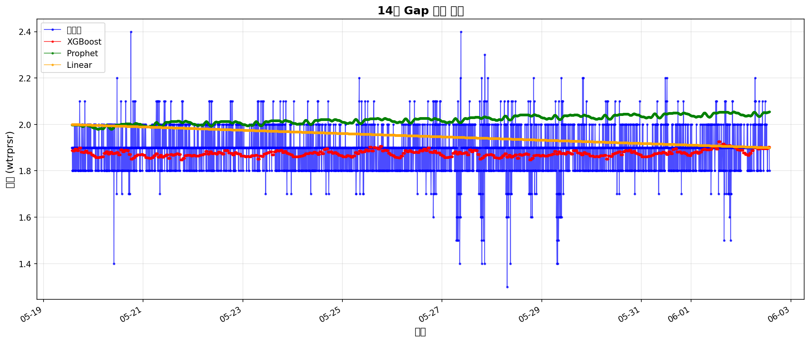

# 14일 Gap 보간 실험 결과

**실험 일자**: 2025-12-10
**Gap 기간**: 2025-05-19 13:40 ~ 2025-06-02 13:40
**Gap 길이**: 14일 (4,033 records)

---

## 📊 성능 요약

### 최종 판정: ❌ 실패 (사용 불가)

### 모델별 성능

| 모델 | MAE | MAPE | R² | 등급 |
|------|-----|------|----|------|
| **XGBoost** | 0.0648 | 3.44% | **-0.0465** | D |
| **Prophet** | 0.1372 | 7.46% | **-2.3907** | D |
| **Linear** | 0.0854 | 4.63% | **-0.5912** | D |

**최고 성능**: XGBoost (R² -0.0465)

---

## 📈 시각화

---

## 🔍 분석

### R² 기준 평가
- **R² > 0.7**: 우수 (실무 사용 권장)
- **R² > 0.5**: 양호 (조건부 사용 가능)
- **R² > 0.3**: 미흡 (신중 사용)
- **R² < 0.3**: 실패 (사용 불가)

### 14일 Gap 결과
- 최고 R²: -0.0465 → **등급 D**
- ❌ 실패 (사용 불가)

---

**보고서 생성**: 2025-12-10 18:14:03
