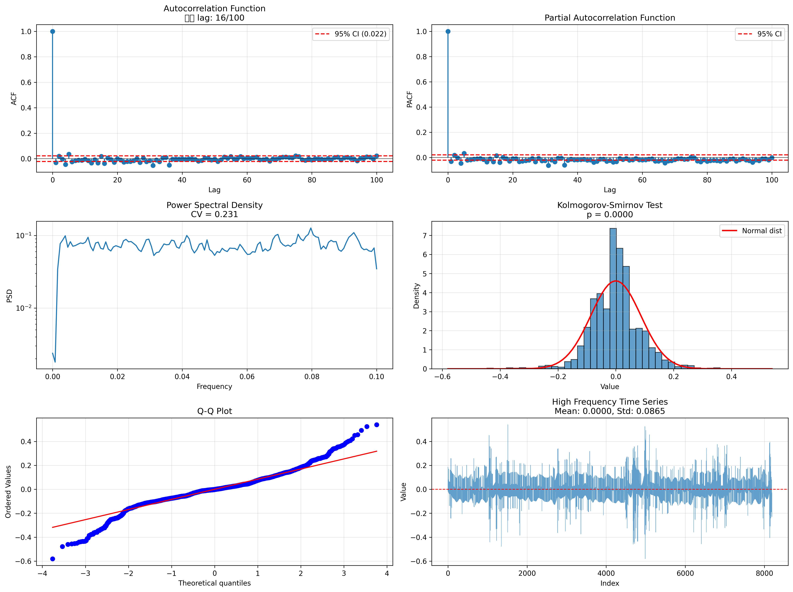

# Phase 3: 고주파 잡음 검증 결과

**분석 일시**: 2025-12-10 22:58:21
**지역**: 0243
**데이터 크기**: 8,192 포인트

---

## 📊 고주파 성분 통계

- **Mean**: 0.000002
- **Std**: 0.086460
- **Min**: -0.580417
- **Max**: 0.539802

---

## 🔬 통계 검정 결과

| 검정 | 통계량/값 | p-value | 판정 | 백색 잡음? |
|------|----------|---------|------|------------|
| Ljung-Box Test | 172.5007 | 0.0000 | 패턴 존재 | ❌ No |
| Runs Test | -13.0381 | 0.0000 | 패턴 존재 | ❌ No |
| 정규성 검정 | 0.0779 | 0.0000 | 비정규분포 | ❌ No |
| Sample Entropy | 0.8625 | N/A | 낮은 무작위성 | ❌ No |
| Power Spectral Density | 0.2309 | N/A | 균일 (백색 잡음) | ✅ Yes |
| ACF 유의성 검정 | 0.1600 | N/A | 자기상관 존재 | ❌ No |

---

## ⚠️ 최종 판정

**백색 잡음 기준 만족**: 1/6 (16.7%)

### 판정: **패턴 존재 가능성**

고주파 성분에 **일부 패턴이 존재**할 가능성이 있습니다.

#### 의미

1. 고주파가 완전한 잡음은 아님
2. XGBoost로 일부 패턴 학습 가능성 존재
3. Phase 3b 진행 고려

#### 다음 단계

- ⚠️ Phase 3b: 저주파/고주파 각각 XGBoost 시도
- 📊 추가 분석: 패턴이 존재하는 lag/주파수 영역 탐색
- 🔍 세부 검증: 어떤 검정에서 패턴이 발견되었는지 확인

---

## 📈 시각화

---

**생성 일시**: 2025-12-10 22:58:21
