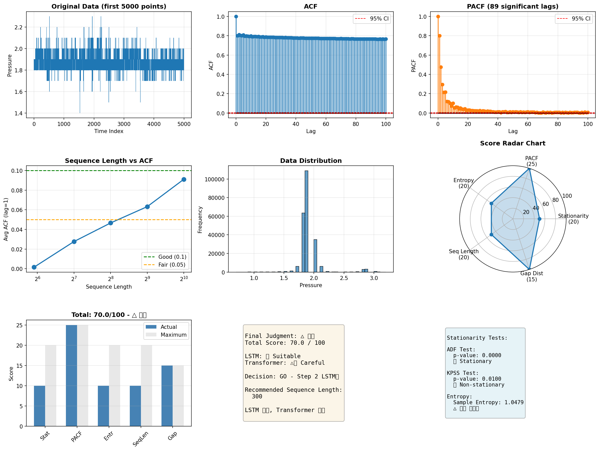

# 데이터 적합성 분석 결과

**분석 일시**: 2025-12-11 01:24:05
**데이터**: 0243 소구역 압력
**데이터 크기**: 231,372 records

---

## 📊 종합 점수

**총점: 70.0 / 100점**

| 항목 | 판정 | 점수 | 최대 |
|------|------|------|------|
| Stationarity | △ 약한 비정상 | 10.0 | 20 |
| PACF | ○ 강한 자기상관 | 25.0 | 25 |
| Entropy | △ 중간 복잡도 | 10.0 | 20 |
| Sequence Length | △ LSTM 권장 | 10.0 | 20 |
| Gap Distribution | ○ 충분 | 15.0 | 15 |

---

## 🎯 최종 판정

### △ 보통

- **LSTM**: ✅ 적합
- **Transformer**: ⚠️ 신중
- **권장 Sequence Length**: 300

### 결정: GO - Step 2 LSTM만

**이유**: LSTM 가능, Transformer 신중

---

## 1. Stationarity 검증

### ADF Test
- Statistic: -5.4824
- p-value: **0.0000**
- 판정: ✅ 정상 시계열

### KPSS Test
- Statistic: 10.9117
- p-value: **0.0100**
- 판정: ❌ 비정상 시계열

### 종합 판정: **△ 약한 비정상** (10.0점)
- 차분 고려

---

## 2. PACF 분석

- 유의 Lag 개수: **89개**
- 최대 유의 Lag: 100
- 권장 Sequence Length: **300**

### 종합 판정: **○ 강한 자기상관** (25.0점)
- LSTM 효과적

---

## 3. 정보 엔트로피

- Sample Entropy: **1.0479**

### 종합 판정: **△ 중간 복잡도** (10.0점)
- 예측 어려움

---

## 4. Sequence Length 실험

| Window Size | Avg ACF |
|-------------|---------|
| 60 | 0.0015 |
| 128 | 0.0277 |
| 256 | 0.0466 |
| 512 | 0.0632 |
| 1024 | 0.0912 |

### 종합 판정: **△ LSTM 권장** (10.0점)
- 256까지 효과적, Transformer는 한계

---

## 5. Gap 분포

- Gap 개수: 0
- 평균 연속 구간: **231372 points**
- 중앙값: 231372 points
- 최소/최대: 231372 / 231372 points

### 종합 판정: **○ 충분** (15.0점)
- 학습 데이터 완벽

---

## 📈 시각화

---

## 🚦 다음 단계

### ✅ GO - Step 2 진행

**이유**: 데이터가 LSTM 학습에 적합합니다.

**다음 작업**:
1. Step 2: Simple LSTM Quick Test 진행
2. 10-step 비재귀 예측으로 핵심 검증
3. R² > 0.5 목표

**권장 설정**:
- Sequence Length: 300
- LSTM layers: 2-3
- Hidden dim: 128-256

---

**작성일**: 2025-12-11 01:24:05
**분석 완료**
