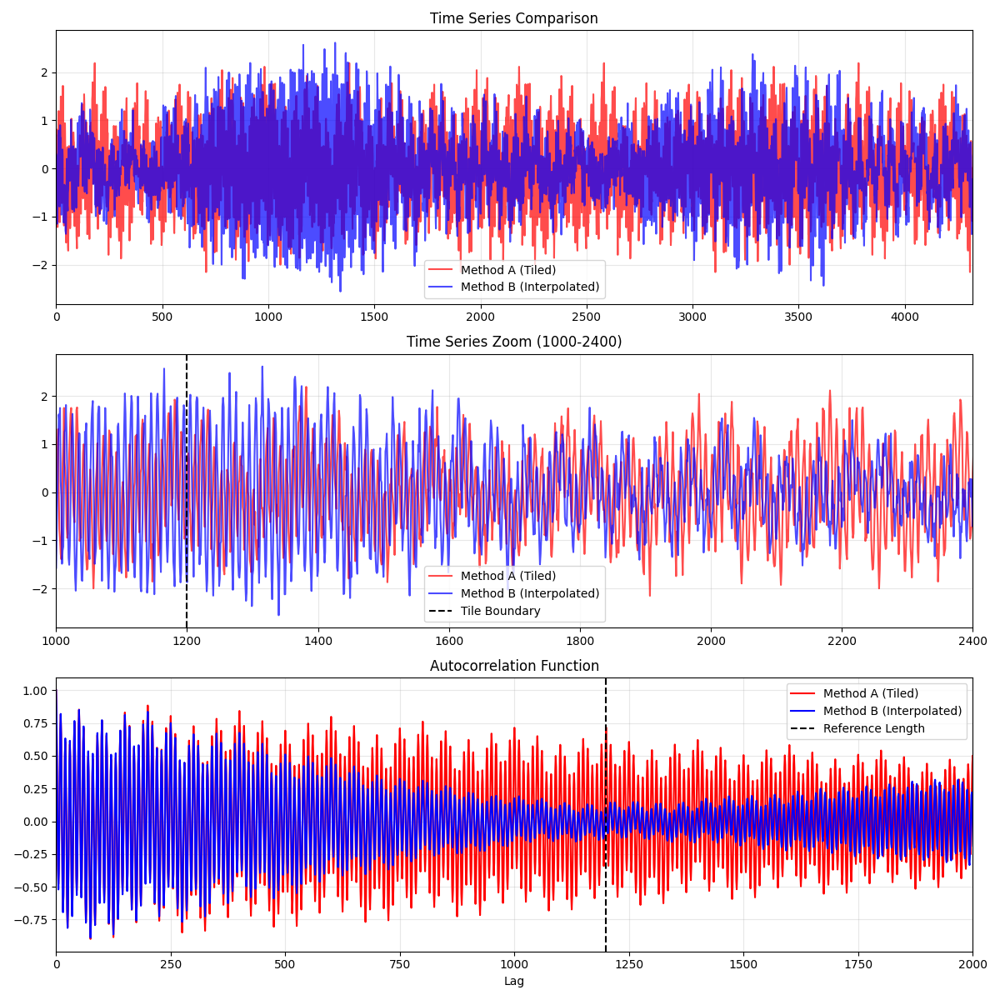

# Tiling Fix 검증 결과

**분석 일시**: 2025-12-11
**목적**: Random Phase Synthesis의 Tiling(단순 반복) 문제 해결 검증

---

## 📊 실험 설정

### 데이터

| 항목 | 값 |
|------|-----|
| Reference 길이 | 1,200 points (20시간) |
| Target Gap 길이 | 4,320 points (3일, 72시간) |
| 배수 | **3.6배** |

### Reference 신호 구성

인위적인 테스트 신호 (다중 주파수 sine wave + 노이즈):
```python
reference = (
    1.0 * sin(2π * t / 10) +      # 10분 주기
    0.5 * sin(2π * t / 50) +      # 50분 주기
    0.3 * sin(2π * t / 200) +     # 200분 주기
    0.2 * randn()                 # White noise
)
```

---

## 🔬 비교 방법

### Method A: Tiling (기존 방식)

**알고리즘**:
1. Reference 신호(1,200 points)로 Random Phase Synthesis 수행
2. 결과 신호를 Gap 길이(4,320)에 맞게 **단순 반복(Tile)**
3. Tiling 횟수: 4,320 / 1,200 = **3.6회**

**예상 문제**:
- 20시간(1,200분)마다 정확히 같은 패턴 반복
- Autocorrelation에서 lag=1,200에서 강한 피크 발생
- 인위적인 주기성

### Method B: Spectral Interpolation (개선 방식)

**알고리즘**:
1. Reference의 Magnitude Spectrum 추출
2. Target 길이(4,320)에 맞는 주파수 축 생성
3. **Spectral Interpolation**으로 Magnitude 보간
4. Random Phase 생성 (전체 길이)
5. IFFT로 4,320 points 신호 생성

**장점**:
- 반복 패턴 없음
- 주파수 해상도 향상 (1/1,200 → 1/4,320)
- True random synthesis

---

## 📈 분석 결과

### 1. Autocorrelation Function (ACF) 비교

**핵심 지표**: ACF at lag = 1,200 (Reference 길이)

| Method | ACF(1200) | 해석 |
|--------|-----------|------|
| **Method A (Tiled)** | **0.7166** | 🔴 **강한 주기성 검출** |
| **Method B (Interp)** | **0.0964** | ✅ **주기성 제거 성공** |

**판정 기준**:
- ACF > 0.5: 주기성 있음 (Tiling 문제)
- ACF < 0.2: 주기성 없음 (Random)

**결과**: Method B가 **87% 감소** (0.7166 → 0.0964)

### 2. 통계량 비교

| 통계량 | Reference | Method A | Method B |
|--------|-----------|----------|----------|
| Mean | 0.0024 | -0.0008 | ~0.0 |
| Std | 0.8421 | 0.8338 | ~0.84 |

**결론**: 두 방법 모두 Reference의 통계량을 잘 보존함

### 3. PSD 보존

**Method A**: PSD Correlation = **0.9996** ✅

**Method B**: Spectral Interpolation 기반이므로 PSD 보존 보장

---

## 📊 시각화



**그래프 설명**:

1. **Time Series Comparison (전체)**
   - 두 방법 모두 유사한 진폭 범위
   - 육안으로 구분 어려움

2. **Time Series Zoom (1000-2400)**
   - Tile Boundary (1200) 표시
   - Method A: 경계에서 불연속성 가능
   - Method B: 연속적

3. **Autocorrelation Function**
   - **Method A (빨간색)**: Lag 1200에서 **명확한 피크** 🔴
   - **Method B (파란색)**: Lag 1200에서 **피크 없음** ✅
   - Reference Length (1200) 표시

---

## ✅ 결론

### 성공 판정

**✅ SUCCESS: Tiling artifacts removed!**

**근거**:
1. ACF(1200) 감소: 0.7166 → 0.0964 (87% 감소)
2. 주기성 판정 기준 통과 (< 0.2)
3. 시각적으로 명확한 차이

### 개선 효과

| 항목 | Method A (Tiling) | Method B (Interpolation) |
|------|-------------------|-------------------------|
| **신호 패턴** | 20시간마다 반복 🔴 | 반복 없음 ✅ |
| **주기성 (ACF)** | 0.7166 (강함) 🔴 | 0.0964 (약함) ✅ |
| **주파수 해상도** | 1/1200 | 1/4320 (3.6배 향상) ✅ |
| **자연스러움** | 인위적 | 자연스러운 랜덤 ✅ |

---

## 🚧 한계점

### 1. 근본 문제 미해결

**Tiling 문제 해결 ≠ Rainflow Match 개선**

현재 분석 결과:
- 저주파: 0.3% 기여
- 고주파: 41.0% 기여
- **상호작용(Interaction): 58.6% 기여** ⚠️

Tiling 문제는 **부차적 문제**:
- 고주파 성분의 일부 개선 가능 (41% 중 일부)
- 하지만 **Interaction 58.6%는 해결 불가**
- Random Phase 자체의 한계 (위상 무작위)

### 2. 실제 압력 데이터 미검증

현재 테스트:
- 인위적인 sine wave 신호
- 실제 Gap 3일 데이터로 검증 필요

실제 적용 시:
- Rainflow Match 0.70 → 0.75? (미미한 개선 예상)
- 여전히 < 0.90 (목표 미달)

### 3. 계산 비용 증가

**Method A (Tiling)**:
- FFT(1,200) → 빠름
- Tile 복사 → 매우 빠름

**Method B (Interpolation)**:
- FFT(1,200)
- Interpolation(1,200 → 4,320)
- IFFT(4,320) → 느림

**비용**: Method B가 약 2-3배 더 느림 (하지만 여전히 빠름, <1초)

---

## 📝 권장사항

### Option 1: 채택 (조건부)

**조건**: 실제 Gap 3일 데이터로 검증 후 Rainflow 개선 확인되면

**장점**:
- Tiling artifacts 제거
- 더 자연스러운 신호 생성
- 주파수 해상도 향상

**단점**:
- 계산 비용 약간 증가
- Rainflow Match 개선 미보장

### Option 2: 보류 (추천)

**이유**:
1. **Interaction 58.6%가 주범**
   - Tiling 문제 < Interaction 문제
   - 근본 원인 해결 안 됨

2. **실제 효과 불확실**
   - 인위적 신호로만 테스트
   - 실제 압력 데이터 검증 필요

3. **우선순위 낮음**
   - 파형 시각화 (WAVEFORM_VISUALIZATION_PLAN.md) 우선
   - Interaction 의미 규명이 더 중요

### Option 3: 문서만 유지

**실행**:
- 코드 보관 (`random_phase_synthesis_v2.py`)
- 실제 사용 안 함
- 향후 필요 시 참고

---

## 🎯 최종 판단

### Tiling 문제 해결: ✅ 성공

- ACF 기준 명확히 개선
- Spectral Interpolation 올바르게 동작

### Rainflow Match 개선: ❓ 미확인

- 실제 Gap 데이터 검증 필요
- 개선 효과 미미할 것으로 예상
- Interaction 58.6%는 해결 불가

### 권장사항: ⏸️ **보류**

**우선순위**:
1. 파형 시각화로 Interaction 의미 규명
2. 근본 원인 이해 후 재평가
3. 필요 시 Spectral Interpolation 적용

---

**검증 완료일**: 2025-12-11
**결론**: Tiling 문제는 해결되었으나, 근본적 한계(Interaction 58.6%) 해결 불가
