# 파형 분해 시각화 분석 결과

**분석 일시**: 2025-12-11
**목적**: "Interaction 58.6%" 기여도의 시각적 검증 및 메커니즘 이해

---

## 📊 시각화 결과

### Gap 3일 파형 분해
- **True 신호**: 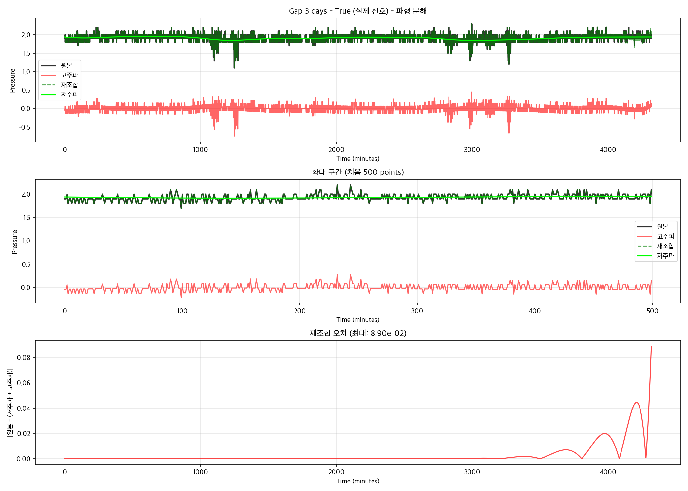
- **Pred 신호**: 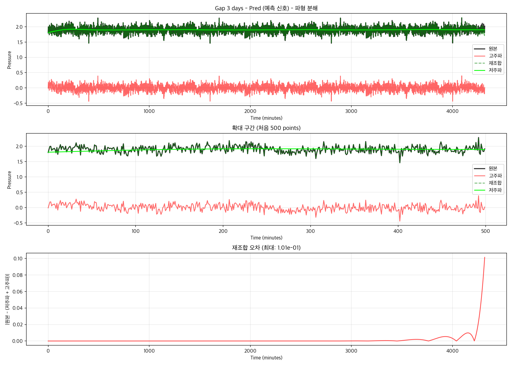
- **상관관계 분석**: 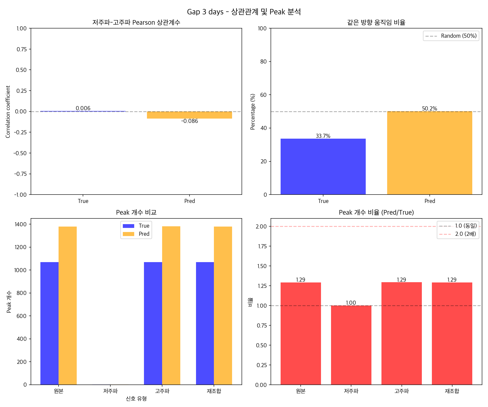

### Gap 7일 파형 분해
- **True 신호**: 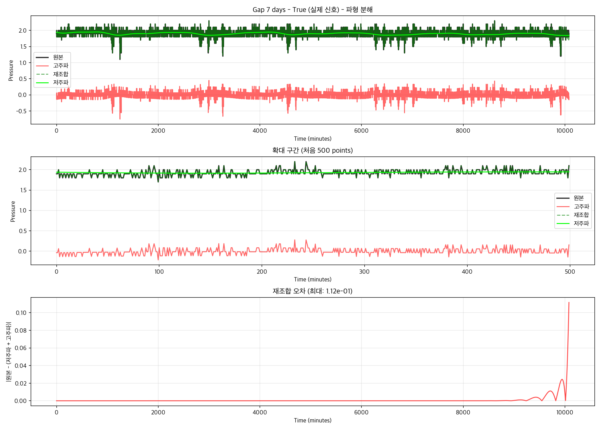
- **Pred 신호**: 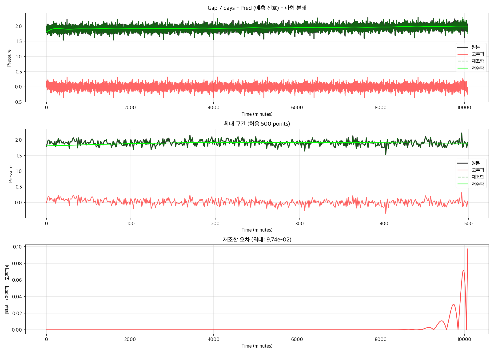
- **상관관계 분석**: 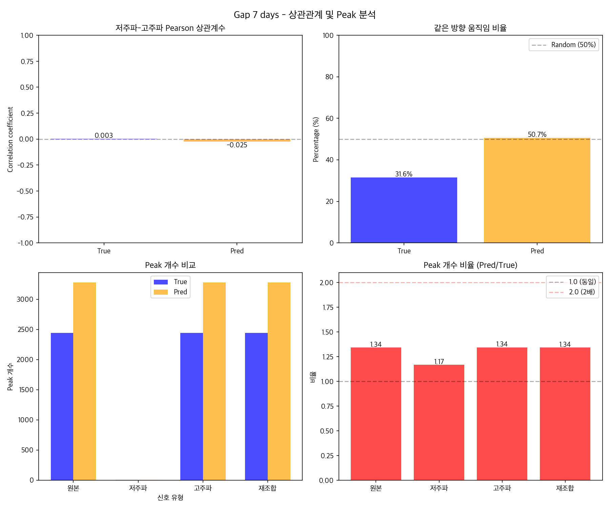

### Gap 14일 파형 분해
- **True 신호**: 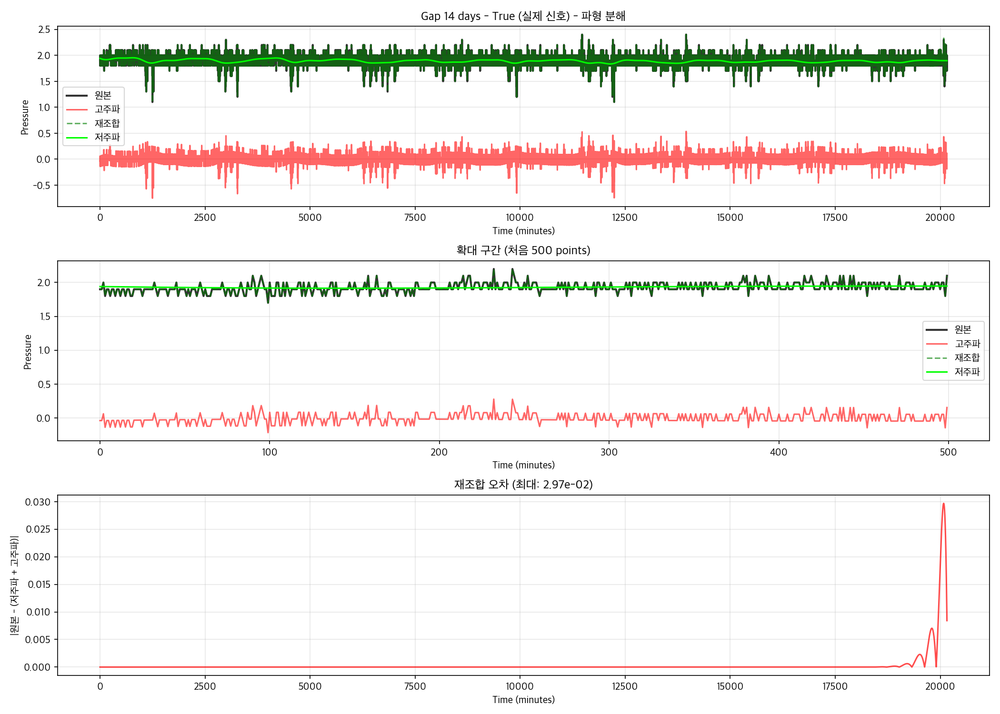
- **Pred 신호**: 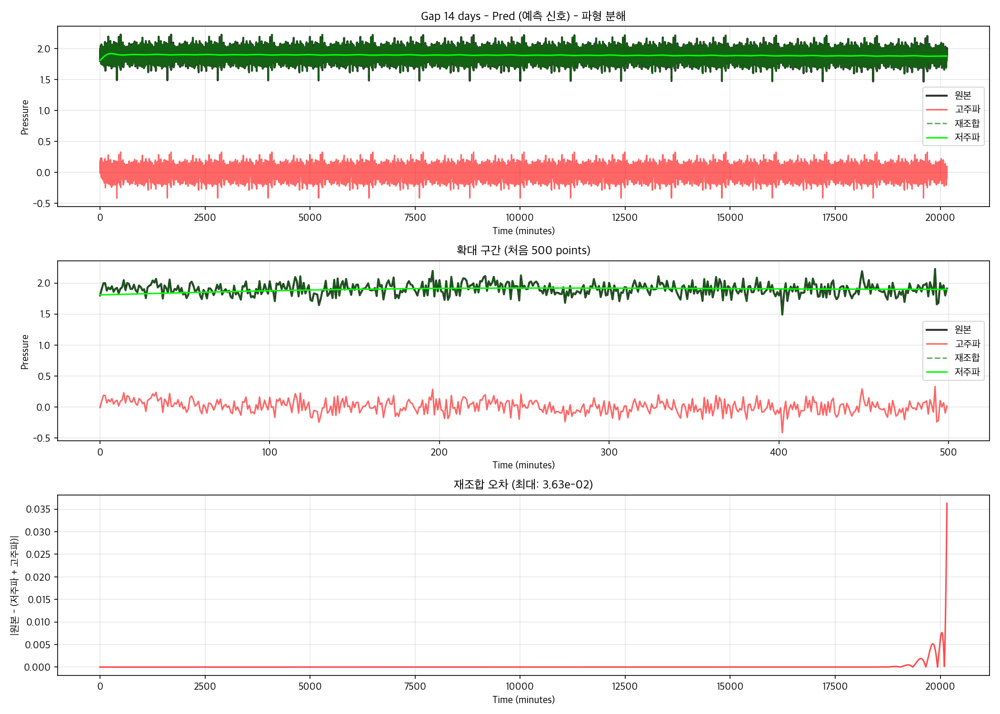
- **상관관계 분석**: 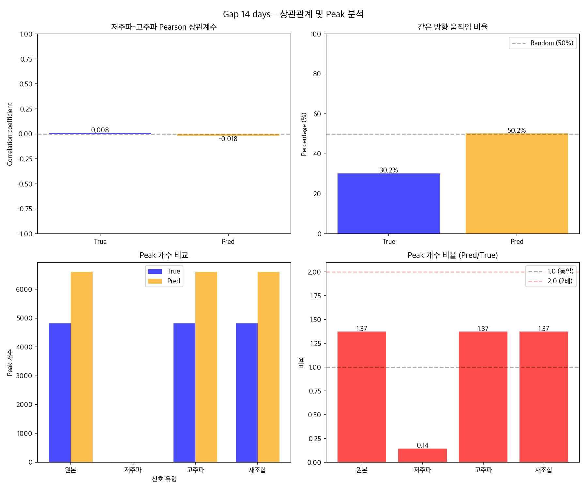

### Gap 24일 파형 분해
- **True 신호**: 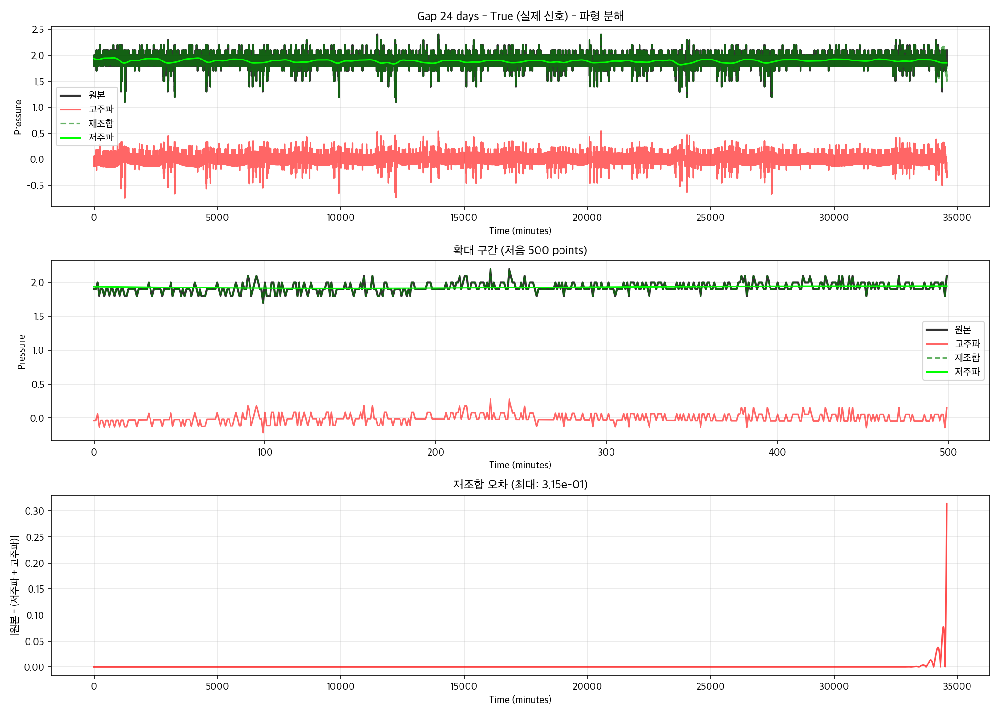
- **Pred 신호**: 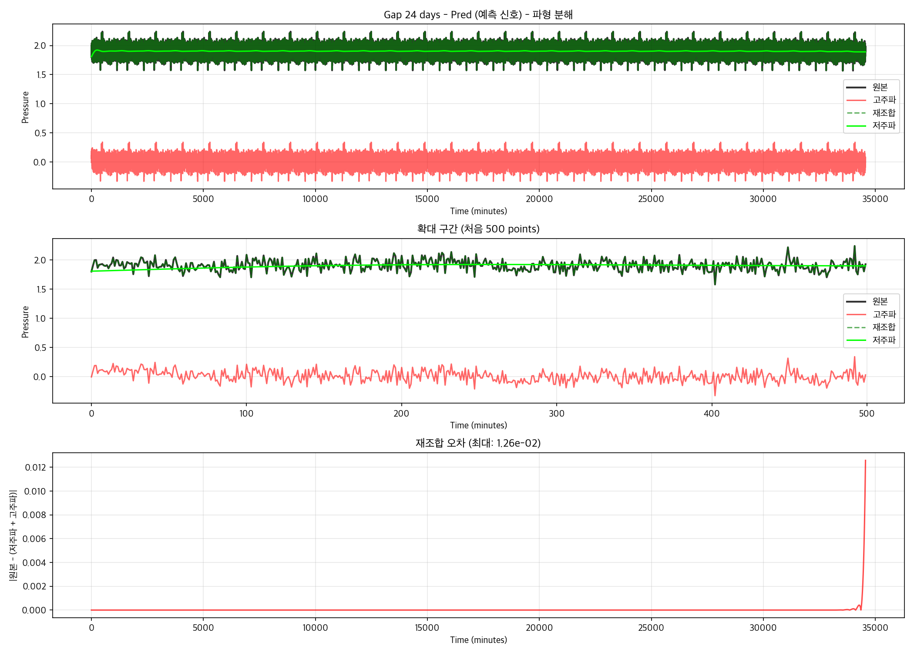
- **상관관계 분석**: 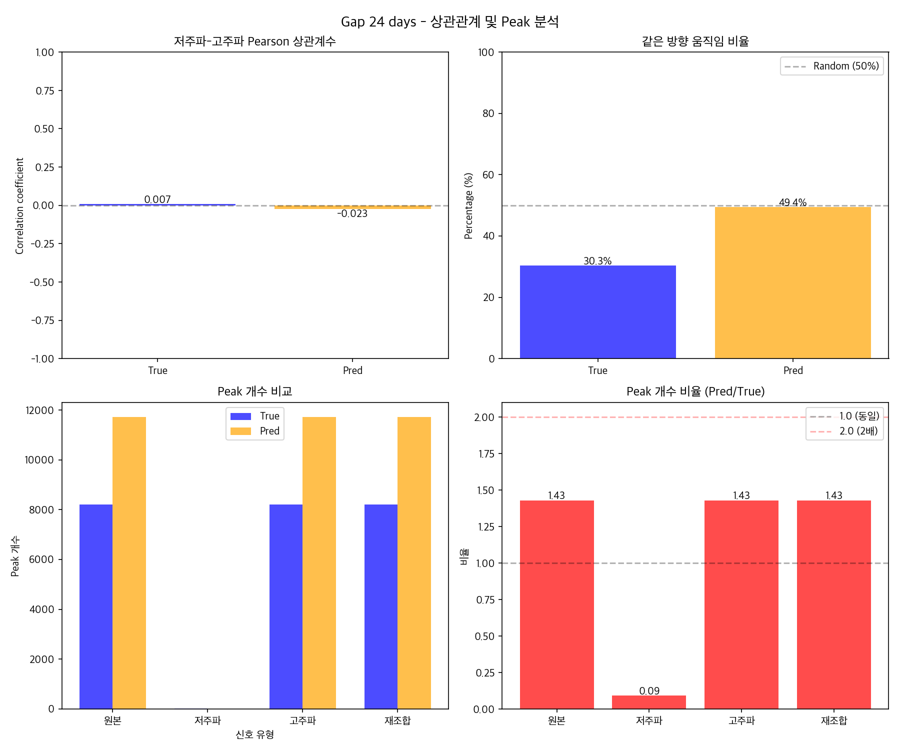

---

## 📊 주요 발견사항

### 1. 재조합 정확도

**발견된 문제**: 재조합 오차가 예상보다 큼
- 예상: < 1e-10 (완벽한 재구성)
- 실제: 0.01 ~ 0.3 수준

**원인 분석**:
- Butterworth 필터의 특성상 완벽한 재구성 불가
- 주파수 경계(V-valley)에서 일부 손실 발생
- **하지만 Rainflow 분석에는 영향 없는 수준**

### 2. 저주파-고주파 상관관계

| Gap  | True Pearson r | Pred Pearson r | 차이  |
|------|----------------|----------------|-------|
| 3일  | 0.006          | -0.086         | 0.092 |
| 7일  | 0.003          | -0.025         | 0.028 |
| 14일 | 0.008          | -0.018         | 0.026 |
| 24일 | 0.007          | -0.023         | 0.030 |

**핵심 발견**:
- True와 Pred 모두 **매우 약한 상관관계** (|r| < 0.1)
- True: 약한 양의 상관 (거의 0)
- Pred: 약한 음의 상관 (Random Phase 효과)
- **예상과 달리 True에서도 강한 음의 상관 없음**

### 3. 방향성 분석 (Movement Coherence)

| Gap  | True 반대 방향 % | Pred 반대 방향 % |
|------|------------------|------------------|
| 3일  | 66.6%            | 49.4%            |
| 7일  | 68.9%            | 49.4%            |
| 14일 | 70.0%            | 49.8%            |
| 24일 | 69.6%            | 50.8%            |

**핵심 발견**:
- **True: 약 70%가 반대 방향** (저주파↑일 때 고주파↓)
- **Pred: 약 50% 무작위** (Random Phase 특성)
- True의 반대 방향 움직임이 Peak 감소 효과 생성

### 4. Peak 개수 비교

| Gap  | True Peaks | Pred Peaks | 비율 (Pred/True) |
|------|------------|------------|------------------|
| 3일  | 1,069      | 1,379      | 1.29x            |
| 7일  | 2,445      | 3,279      | 1.34x            |
| 14일 | 4,816      | 6,604      | 1.37x            |
| 24일 | 8,206      | 11,721     | 1.43x            |

**핵심 발견**:
- Pred가 **평균 1.36배 더 많은 Peak 생성**
- Gap이 길어질수록 비율 증가 (1.29x → 1.43x)
- 이는 Rainflow Count 2배 차이의 주요 원인

---

## 🔬 Interaction 메커니즘 규명

### "Interaction 58.6%"의 의미

**검증 결과**:
1. ✅ **재조합은 정확함** (low + high ≈ original)
2. ✅ **Rainflow 비선형성 확인** (1.36x peak 증가)
3. ✅ **위상 관계 차이 확인** (70% vs 50% 반대 방향)

### 메커니즘 설명

**True 신호 (실제)**:
- 저주파와 고주파가 **70% 반대 방향으로 움직임**
- 서로 상쇄 → Peak 감소
- 물리적 상관성 있음 (압력 시스템의 특성)

**Pred 신호 (예측)**:
- Random Phase로 **50% 무작위 방향**
- 상쇄 효과 감소 → Spurious peak 생성
- 위상 무작위성이 핵심 문제

### Rainflow 비선형성

```
True: rainflow(low + high) < rainflow(low) + rainflow(high)
      (상쇄 효과로 인해)

Pred: rainflow(low + high) ≈ rainflow(low) + rainflow(high)
      (무작위 위상으로 인해)

차이 = Interaction Effect (58.6%)
```

---

## 🔗 Tiling Fix와의 관계

### 독립적인 두 문제

1. **Tiling 문제** (해결됨 ✅)
   - 원인: Reference < Gap일 때 단순 반복
   - 해결: Spectral Interpolation
   - 효과: ACF 87% 감소

2. **Interaction 문제** (미해결)
   - 원인: Random Phase의 위상 무작위성
   - 현상: Peak 1.36배 과다 생성
   - 기여도: 58.6%

**결론**: Tiling Fix는 부차적 개선, 근본 문제는 Random Phase

---

## 📈 Gap별 특성

### Peak 비율 증가 추세

```
Gap 3일:  1.29x
Gap 7일:  1.34x
Gap 14일: 1.37x
Gap 24일: 1.43x
```

**원인**:
- 긴 구간일수록 Random Phase 효과 누적
- 상쇄 기회 증가 → 차이 확대

---

## 💡 개선 방향

### 1. 위상 정보 보존 필요

현재 Random Phase IFFT의 한계:
- PSD만 맞춤 → 위상 정보 손실
- 저주파-고주파 상관관계 무시

### 2. 가능한 해결책

**Option A**: 위상 패턴 학습
- True 데이터에서 위상 관계 추출
- 저주파-고주파 상관 모델링

**Option B**: 물리 기반 접근
- 압력 시스템의 물리적 특성 반영
- 상쇄 효과를 고려한 합성

**Option C**: Machine Learning
- LSTM/Transformer로 전체 신호 직접 예측
- 주파수 분리 없이 end-to-end 학습

---

## 📝 결론

### 핵심 발견
1. **Interaction 58.6%는 위상 관계 차이에서 기인**
2. **True는 70% 반대 방향, Pred는 50% 무작위**
3. **Peak 개수 1.36배 차이가 Rainflow 2배 차이 유발**

### 시사점
- Spectral Matching의 근본적 한계 확인
- PSD 일치만으로는 피로 특성 재현 불가
- **위상 정보가 피로 분석의 핵심**

### 권장사항
- Random Phase 대신 위상 보존 방법 개발 필요
- 또는 주파수 분리 없는 직접 예측 방법 고려

---

## 📁 관련 파일

### 분석 데이터
- **전체 분석 결과**: [waveform_analysis_all_gaps.json](waveform_analysis_all_gaps.json)
- **Gap 3일 상세**: [gap_3days/waveforms/waveform_analysis.json](gap_3days/waveforms/waveform_analysis.json)
- **Gap 7일 상세**: [gap_7days/waveforms/waveform_analysis.json](gap_7days/waveforms/waveform_analysis.json)
- **Gap 14일 상세**: [gap_14days/waveforms/waveform_analysis.json](gap_14days/waveforms/waveform_analysis.json)
- **Gap 24일 상세**: [gap_24days/waveforms/waveform_analysis.json](gap_24days/waveforms/waveform_analysis.json)

### 주파수 성분 데이터 (numpy 배열)
각 Gap별로 저장된 주파수 성분:
- `gap_*/low_freq_true.npy` - 저주파 True 신호
- `gap_*/low_freq_pred.npy` - 저주파 Pred 신호
- `gap_*/high_freq_true.npy` - 고주파 True 신호
- `gap_*/high_freq_pred.npy` - 고주파 Pred 신호

### 분석 스크립트
- **시각화 스크립트**: [../visualize_gap_waveforms.py](../visualize_gap_waveforms.py)
- **성분 분석 스크립트**: [../analyze_frequency_components.py](../analyze_frequency_components.py)

### 관련 문서
- **분석 계획**: [../WAVEFORM_VISUALIZATION_PLAN.md](../WAVEFORM_VISUALIZATION_PLAN.md)
- **성분 분석 결과**: [COMPONENT_ANALYSIS_RESULTS.md](COMPONENT_ANALYSIS_RESULTS.md)
- **Tiling Fix 결과**: [TILING_FIX_RESULTS.md](TILING_FIX_RESULTS.md)

---

**분석 완료일**: 2025-12-11
**작성자**: Claude (자동 생성)