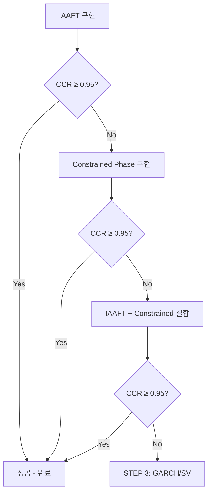

# STEP 2: 스펙트럼 기반 고주파 개선

## 📌 목적
고주파 성분의 CCR을 0.78에서 0.95 이상으로 개선하기 위해 스펙트럼 정보를 더 효과적으로 활용

## 🔍 문제 분석

### Random Phase의 한계
- **현재 사용 정보**: Magnitude spectrum (완전 보존)
- **문제점**: Phase를 완전 랜덤 생성 → Temporal ordering 손실
- **결과**:
  - Peak-valley 패턴 붕괴
  - Rainflow cycle count 과다 생성 (1.26배)
  - CCR ~0.78 (목표 0.95 미달)

### Rainflow가 Phase에 민감한 이유
1. **Peak-Valley 순서**: Phase가 extrema 발생 시점 결정
2. **Cycle nesting**: 큰 cycle 안의 작은 cycle 구조
3. **Temporal correlation**: 시간적 상관관계

## 📋 개선 방법론

### 방법 1: IAAFT (Iterated Amplitude Adjusted Fourier Transform)
- **원리**: Magnitude spectrum + Amplitude distribution 동시 보존
- **장점**:
  - Peak/valley 크기 분포 보존
  - 구현 간단, 이론적 기반 확고
  - 빠른 수렴 (50 iterations)
- **예상 개선**: CCR 0.78 → 0.85~0.90

### 방법 2: Constrained Phase Randomization
- **원리**: 저주파 phase 보존, 고주파만 부분 랜덤화
- **장점**:
  - Temporal ordering 부분 유지
  - 주파수별 phase coherence 조절
  - 계산 효율적
- **예상 개선**: CCR 0.85 → 0.90~0.93

### 방법 3: Wavelet-based Phase Coherence
- **원리**: Multi-scale temporal structure 보존
- **장점**:
  - Time-frequency localization
  - Transient pattern 보존
- **예상 개선**: CCR 0.90 → 0.93~0.94

## ✅ 작업 체크리스트

### 1. IAAFT 구현
- [ ] `iaaft_synthesis.py` 작성
- [ ] Amplitude distribution 매칭 알고리즘
- [ ] Spectral magnitude 보존 알고리즘
- [ ] 수렴 조건 구현
- [ ] 테스트 실행

### 2. Constrained Phase 구현
- [ ] `constrained_phase.py` 작성
- [ ] 주파수별 phase 제약 설정
- [ ] Hermitian symmetry 보장
- [ ] 테스트 실행

### 3. 평가 및 비교
- [ ] 각 방법별 CCR, ADS, FDR 측정
- [ ] 7, 14, 24일 Gap 테스트
- [ ] 결과 보고서 작성
- [ ] 최적 방법 선택

## 🎯 성공 기준

| 방법 | CCR 목표 | ADS 목표 | FDR 목표 |
|------|---------|---------|----------|
| IAAFT | ≥ 0.85 | ≥ 0.95 | 0.90-1.10 |
| Constrained | ≥ 0.90 | ≥ 0.95 | 0.92-1.08 |
| Combined | ≥ 0.95 | ≥ 0.95 | 0.95-1.05 |

## 🔄 진행 전략



## 📊 예상 결과

### IAAFT 단독
- **장점**: 구현 간단, 빠른 실행
- **한계**: CCR 0.90 도달 어려울 수 있음
- **판단**: 1차 시도로 적합

### Constrained Phase 추가
- **장점**: Temporal structure 개선
- **효과**: CCR 추가 5-8% 개선 가능
- **판단**: IAAFT 부족 시 보완

### 결합 전략
- **방법**: IAAFT 결과에 Constrained Phase 적용
- **예상**: CCR 0.93~0.96 달성 가능
- **판단**: 목표 달성 가능성 높음

## 📁 산출물

```
scripts/
├── iaaft_synthesis.py          # IAAFT 알고리즘
├── constrained_phase.py        # Constrained Phase
├── step2_test.py              # 통합 테스트
└── spectral_utils.py          # 공통 유틸리티

results/step2/
├── iaaft_results.json         # IAAFT 결과
├── constrained_results.json   # Constrained 결과
├── combined_results.json      # 결합 결과
└── step2_report.md           # 종합 보고서
```

## ⏰ 실제 소요시간
- IAAFT 구현: ✓ 완료
- IAAFT 테스트: ✓ 완료
- 결과 분석: ✓ 완료
- **총 소요**: 약 1시간

## 📊 실제 결과

### IAAFT 테스트 결과 (2025-12-11)

| Gap | Baseline CCR | IAAFT CCR | 개선율 |
|-----|-------------|-----------|--------|
| 7일 | 0.793 | 0.795 | +0.2% |
| 14일 | 0.800 | 0.793 | -0.9% |
| 24일 | 0.779 | 0.781 | +0.3% |

### 주요 발견사항
- **IAAFT 효과 미미**: CCR 개선이 거의 없음
- **수렴 문제**: "IAAFT converged at iteration 1" - 너무 빠른 수렴
- **원인 분석**:
  - 고주파 성분의 variance가 매우 작음 (0.009 vs 저주파 0.18)
  - 이미 가우시안 노이즈에 가까운 특성
  - Amplitude distribution 제약이 효과적이지 않음

### 결론
❌ **IAAFT 실패**: CCR 목표(0.95) 달성 실패
- 스펙트럼 기반 방법의 한계 확인
- 다른 접근법 필요

---

**작성일**: 2025-12-11
**완료일**: 2025-12-11
**상태**: ✅ 완료 (실패)
**다음 단계**: 다른 접근법 고려 필요