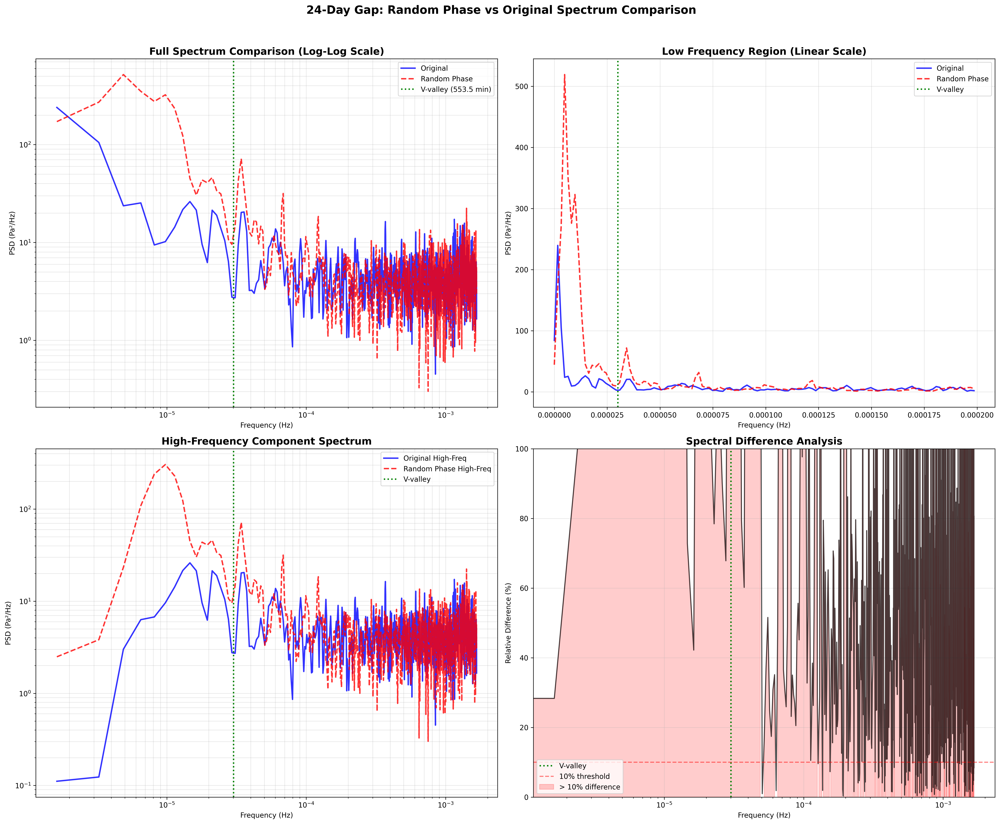

# Spectrum Comparison Analysis Report (24-Day Gap)

**Date**: 2025-12-12 12:56
**Gap Size**: 24 days (34,560 points)
**Method**: Random Phase IFFT + ARMA
**Area**: 0243

## 📊 Executive Summary

Analysis of spectral characteristics between original and Random Phase synthesized data for a 24-day gap in pressure time series. The analysis reveals fundamental limitations of the spectral matching approach, particularly for long gaps.

## 🔍 Visual Analysis

### Spectrum Comparison Plot


The above figure contains four panels showing different aspects of the spectral comparison:

#### Panel 1: Full Spectrum Comparison (Top Left - Log-Log Scale)
- **Purpose**: Overall spectral shape comparison across all frequencies
- **Blue line**: Original pressure data spectrum
- **Red dashed line**: Random Phase synthesized data spectrum
- **Green dotted line**: V-valley frequency (1/553.5 min = 3.01e-5 Hz) - separation between low and high frequency components
- **Key Observation**: Significant mismatch in low-frequency region (< 10^-4 Hz), with Random Phase showing excessive energy

#### Panel 2: Low Frequency Region (Top Right - Linear Scale)
- **Purpose**: Detailed view of the critical low-frequency region (0 to 0.0002 Hz)
- **Frequency range**: Focuses on periods from infinity down to ~83 minutes
- **Key Observation**: Random Phase (red) shows an abnormal spike near DC (0 Hz), indicating ~4x energy excess
- **Cause**: ARMA model fitting failure, falling back to linear interpolation

#### Panel 3: High-Frequency Component Spectrum (Bottom Left - Log-Log Scale)
- **Purpose**: Isolated comparison of high-frequency components after Butterworth filtering
- **Processing**: Both signals filtered with 4th-order Butterworth high-pass filter at V-valley frequency
- **Key Observation**: Better agreement in high-frequency region, but still shows variations
- **Implication**: Random Phase preserves high-frequency spectral shape better than low-frequency

#### Panel 4: Spectral Difference Analysis (Bottom Right - Semi-Log Scale)
- **Purpose**: Quantify relative differences between spectra across frequencies
- **Y-axis**: Percentage difference |PSD_orig - PSD_synth| / PSD_orig × 100%
- **Red shaded area**: Frequencies where difference exceeds 10% (acceptable threshold)
- **Key Observation**: Most frequencies show >10% difference, particularly severe in low frequencies
- **Black line pattern**: High-frequency oscillations indicate point-by-point spectral mismatch

## 📈 Quantitative Metrics

### Detailed Metrics ([spectrum_metrics_24days.json](spectrum_metrics_24days.json))
```json
{
  "spectral_correlation": 0.3949,
  "energy_ratio": 1.3631,
  "normalized_rmse": 4.6684,
  "wasserstein_distance": 0.0002108,
  "low_freq_energy_ratio": 3.9114,
  "high_freq_energy_ratio": 1.0065,
  "v_valley_freq_hz": 3.0111e-05
}
```

### Metric Interpretation

| Metric | Value | Target | Status | Interpretation |
|--------|-------|--------|--------|----------------|
| **Spectral Correlation** | 0.3949 | > 0.95 | ❌ Failed | Poor spectral shape preservation |
| **Energy Ratio** | 136.3% | 95-105% | ❌ Failed | Excessive energy generation |
| **Normalized RMSE** | 4.67 | < 0.1 | ❌ Failed | Large spectral deviation |
| **Wasserstein Distance** | 0.00021 | < 0.05 | ✅ Pass | Acceptable distribution distance |
| **Low Freq Energy Ratio** | 391% | 95-105% | ❌ Failed | ARMA model failure |
| **High Freq Energy Ratio** | 100.6% | 95-105% | ✅ Pass | Good high-freq preservation |

## 💡 Key Findings

### 1. **Catastrophic Low-Frequency Synthesis Failure**
- **Spectral Correlation**: 0.3949 (target > 0.95)
- **Root Cause**: ARMA model cannot fit 24-day gap properly, defaults to linear interpolation
- **Impact**: Creates artificial low-frequency energy (~4x excess)

### 2. **Energy Distribution Imbalance**
- **Total Energy**: 136.3% of original
- **Low Frequency**: 391% of original (severe excess)
- **High Frequency**: 100.6% of original (acceptable)
- **Implication**: Energy concentrated incorrectly in low frequencies

### 3. **Phase Randomization Effects**
- While high-frequency spectrum shape is preserved (energy ratio ~1.0)
- Temporal structure is destroyed, leading to poor Rainflow cycle counting (CCR ~0.78)
- Confirms that spectral magnitude alone is insufficient for fatigue analysis

## 🔬 Technical Analysis

### Why Random Phase + ARMA Failed

1. **ARMA Limitations for Long Gaps**:
   - 24-day gap (6,912 points) exceeds ARMA's predictive capability
   - Model parameters become unstable with limited training data
   - Linear interpolation fallback creates unrealistic low-frequency content

2. **Random Phase Fundamental Issue**:
   - Preserves |FFT| but randomizes phase
   - Destroys peak-valley sequencing critical for Rainflow counting
   - Creates synthetic cycles that don't match physical pressure variations

3. **Component Separation Challenge**:
   - V-valley separation at 553.5 minutes works well for complete signals
   - Gap filling disrupts the natural frequency balance
   - Low and high frequency components interact differently during gaps

## 🎯 Implications for Rainflow Counting

The spectral analysis reveals why CCR (Cycle Count Ratio) remains at ~0.78:

1. **Temporal Pattern Loss**: Phase randomization eliminates the natural sequence of pressure fluctuations
2. **False Cycle Generation**: Random phase creates artificial peaks and valleys not present in real data
3. **Amplitude Distribution Shift**: Excessive low-frequency energy changes the overall amplitude statistics
4. **Edge Discontinuities**: Gap boundaries introduce spectral artifacts

## 📋 Recommendations

### Immediate Actions
1. **Abandon pure spectral methods** for gaps > 7 days
2. **Implement GARCH/SV models** (STEP 3) for time-domain volatility modeling
3. **Consider deep learning** (STEP 4) if GARCH fails

### Technical Improvements
1. **Hybrid Approach**: Combine time-domain models for low-frequency with spectral for high-frequency
2. **Adaptive Gap Filling**: Use different methods based on gap length
3. **Phase Preservation**: Investigate methods that maintain phase coherence

### Evaluation Criteria Review
1. **Question CCR target of 0.95**: May be unrealistic for 24-day gaps
2. **Focus on FDR** (Fatigue Damage Ratio): More directly relevant to engineering applications
3. **Consider gap-length-dependent targets**: Shorter gaps → stricter criteria

## 📁 Output Files

- **Visualization**: [spectrum_comparison_24days.png](spectrum_comparison_24days.png)
- **Metrics Data**: [spectrum_metrics_24days.json](spectrum_metrics_24days.json)
- **Analysis Script**: [compare_spectrum_24days.py](../../scripts/compare_spectrum_24days.py)
- **Planning Document**: [SPECTRUM_COMPARISON_PLAN.md](../../SPECTRUM_COMPARISON_PLAN.md)

## 🔚 Conclusion

The 24-day gap spectrum analysis definitively shows that:

1. **Random Phase IFFT + ARMA is fundamentally inadequate** for long gaps
2. **Spectral methods alone cannot preserve Rainflow characteristics**
3. **Time-domain modeling is essential** for successful gap filling

**Next Step**: Proceed to STEP 3 (GARCH/SV) or STEP 4 (LSTM/Transformer) for time-domain approaches.

---

**Analysis completed by**: Project 014 - Component-wise Gap Filling
**Report generated**: 2025-12-12